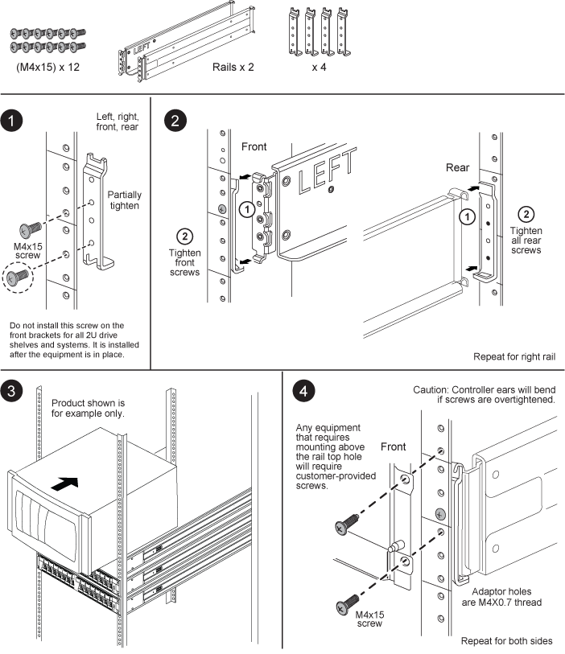

= 超級軌道套件安裝說明
:allow-uri-read: 
:icons: font
:imagesdir: ../media/

[role="lead"]
您可以使用圓對方孔轉接器支架、將超級滑軌安裝在標準方孔四柱機架或標準圓孔四柱機架上。

NOTE: 用於安裝 SuperRail 的前後連接點之間的最小深度為 24 英吋、最大深度為 32 英吋。

== 將超級滑軌安裝至四柱式機架的方孔

image::../media/drw_superrail_square_hole_four_post_kit_re_release.png[如何將 SuperRail 安裝到四柱式機架的方孔中]

== 將超級滑軌安裝到四柱式機架的圓孔中

