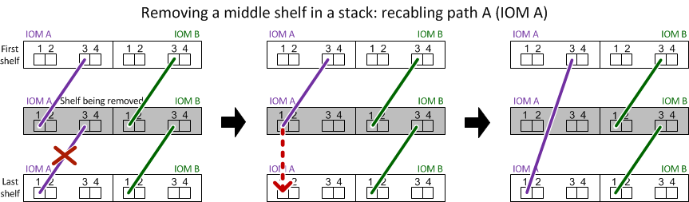

= 熱移除機櫃-配備IOM12/IOM12B模組的機櫃
:allow-uri-read: 
:icons: font
:imagesdir: ../media/

[role="lead"]
您可以使用IOM12/IOM12B模組熱移除磁碟櫃（不中斷營運地從已開機且I/O正在進行的系統移除磁碟櫃）、以便在需要移動或更換磁碟櫃時進行。您可以從磁碟櫃堆疊內的任何位置熱移除一或多個磁碟櫃、或是移除磁碟櫃堆疊。

.開始之前
* 您的系統必須是多重路徑HA、多重路徑、四重路徑HA或四重路徑組態。
+
對於內建儲存設備的平台、例如AFF ：E20A200、AFF E20220、FAS2600系列和FAS2700系統、外部儲存設備必須以多重路徑HA或多重路徑的纜線連接。

+

NOTE: 對於使用多重路徑連線的外接式儲存設備、FAS2600系列單一控制器系統來說、系統是混合路徑組態、因為內部儲存設備使用單一路徑連線。

* 您的系統無法顯示任何SAS纜線錯誤訊息。
+
您可以下載並執行Active IQ Config Advisor 此功能、以檢視任何SAS纜線錯誤訊息、以及您應採取的修正行動。

+
https://mysupport.netapp.com/site/tools/tool-eula/activeiq-configadvisor["NetApp下載Config Advisor"]

* HA配對組態無法處於接管狀態。
* 您必須從要移除的磁碟櫃中、移除磁碟機的所有集合體（磁碟機必須是備用磁碟機）。
+

NOTE: 如果您嘗試在您要移除的磁碟櫃上執行此程序、可能會導致系統故障、並出現多磁碟故障。

+
您可以使用「shorage aggregate offline -Aggregate _Aggregate name_」命令、然後使用「shorage aggregate delete -Aggregate _name_」命令。

* 如果您要從堆疊中移除一或多個磁碟櫃、必須將移除磁碟櫃的距離納入考慮範圍、因此如果目前的纜線不夠長、您需要更長的纜線。

.關於這項工作
* *最佳實務做法：*最佳實務做法是在移除磁碟櫃中的磁碟機集合體之後、移除磁碟機擁有權。
+
從備用磁碟機移除擁有權資訊、可讓磁碟機正確整合至另一個節點（視需要）。

[NOTE]
====
移除磁碟機擁有權的程序需要停用磁碟擁有權自動指派。在此程序結束時、您可以重新啟用磁碟擁有權自動指派。

https://docs.netapp.com/us-en/ontap/disks-aggregates/index.html["磁碟與集合體總覽"]

====
* 對於ONTAP 超過兩個節點的叢集式支援系統、最佳做法是將epsilon重新指派給正在進行規劃維護的HA配對。
+
重新指派epsilon可將對叢集ONTAP 式故障系統中所有節點造成未預期錯誤的風險降至最低。您可以使用下列步驟來判斷保留epsilon的節點、並視需要重新指派epsilon：

+
.. 將權限層級設為進階：「et -priv榮幸advanc進 階」
.. 確定哪個節點保留epsilon：「cluster show」
+
epsilon的節點在"Epsilon（Epsilon）"欄位中顯示「true（真）」。（不包含epsilon的節點顯示「假」。）

.. 如果正在進行維護的HA配對中的節點顯示「true」（保留epsilon）、則從節點移除epsilon：「cluster modify -node_node_name_-epsilon false」
.. 將epsilon指派給另一個HA配對中的節點：「cluster modify -node_node_name_-epsilon true」
.. 返回管理員權限等級：「et -priv. admin」

* 如果您要從堆疊熱移除磁碟櫃（但保留堆疊）、您可以一次重新恢復並驗證一條路徑（路徑A接著路徑B）、以繞過您要移除的磁碟櫃、以便永遠維持從控制器到堆疊的單一路徑連線。
+

NOTE: 如果在重新啟用堆疊以略過您要移除的磁碟櫃時、未維持從控制器到堆疊的單一路徑連線、則可能會在多磁碟恐慌中使系統故障。

* *可能的機櫃毀損：*如果您要移除DS460C機櫃、並將其移至資料中心的其他部分、或將其移至不同位置、請參閱 <<Move or transport DS460C shelves>> 在本程序結束時。

.步驟
. 驗證您的系統組態是否為「Multi-Path HA」、「Multi-Path」、「Quad-path HA」或「Quad-path」：「Sysconfig」
+
您可以從任一控制器的節點程式執行此命令。系統可能需要一分鐘時間才能完成探索。

+
此組態會列在「System Storage Configuration（系統儲存組態）」欄位中。

+

NOTE: 對於使用多重路徑連線的外部儲存設備、FAS2600系列單一控制器系統、由於內部儲存設備使用單一路徑連線、因此輸出會顯示為「mithxed path」。

. 確認您要移除的磁碟櫃中的磁碟機沒有集合體（為備用磁碟機）、而且已移除擁有權：
+
.. 在任一控制器的clusterShell中輸入以下命令：「torage disk show -ber櫃_bering_number_」
.. 檢查輸出、確認您要移除的磁碟機櫃中沒有集合體。
+
沒有集合體的磁碟機在「Container Name」（容器名稱）欄位中會有一個破折號。

.. 檢查輸出、確認您要移除磁碟櫃上的磁碟機已移除擁有權。
+
沒有擁有權的磁碟機在「擁有者」欄位中會有一個破折號。

+

NOTE: 如果您要移除的磁碟機櫃中有故障、磁碟機就會在「Container Type（容器類型）」欄位中毀損。（故障磁碟機沒有所有權。）

+
下列輸出顯示要移除磁碟櫃上的磁碟機（磁碟櫃3）處於正確狀態、可用來移除磁碟櫃。所有磁碟機上的集合體都會移除、因此每個磁碟機的「Container Name」（容器名稱）欄會出現一個破折號。所有磁碟機的擁有權也會移除、因此每個磁碟機的「擁有者」欄會出現破折號。

+
[listing]
----
cluster::> storage disk show -shelf 3

           Usable           Disk   Container   Container
Disk         Size Shelf Bay Type   Type        Name       Owner
-------- -------- ----- --- ------ ----------- ---------- ---------
...
1.3.4           -     3   4 SAS    spare                -         -
1.3.5           -     3   5 SAS    spare                -         -
1.3.6           -     3   6 SAS    broken               -         -
1.3.7           -     3   7 SAS    spare                -         -
...
----
. 實際找到您要移除的磁碟櫃。
+
如有需要、您可以開啟磁碟櫃的位置（藍色）LED、以協助實際找出受影響的磁碟櫃：「儲存櫃位置導向的修改-機櫃名稱_bidle_name_-leide-Status on」

+

NOTE: 磁碟櫃有三個位置LED：一個在操作員顯示面板上、一個在每個IOM12模組上。位置LED會持續亮起30分鐘。您可以輸入相同的命令、但使用「關閉」選項來關閉這些命令。

. 如果您要移除整個磁碟櫃堆疊、請完成下列子步驟；否則、請執行下一步：
+
.. 拔下路徑A（IOM A）和路徑B（IOM B）上的所有SAS纜線。
+
這包括控制器對機櫃纜線、以及您要移除堆疊中所有磁碟櫃的機櫃對機櫃纜線。

.. 前往步驟9。

. 如果您要從堆疊中移除一或多個磁碟櫃（但保留堆疊）、請完成適用的子步驟集、重新恢復路徑A（IOM A）堆疊連線、以跳過您要移除的磁碟櫃：
+
如果您要移除堆疊中的多個磁碟櫃、請一次完成一組適用的子步驟、一次完成一個磁碟櫃。

+

NOTE: 連接連接埠之前、請至少等待10秒鐘。SAS纜線連接器採用鎖定式設計；若方向正確放入SAS連接埠、連接器會卡入定位、而磁碟櫃SAS連接埠LNK LED會亮起綠色。若為磁碟櫃、請插入SAS纜線連接器、拉片朝下（位於連接器底部）。

+
[cols="2*"]
|===
| 如果您要移除... | 然後... 

 a| 
從堆疊的任一端（邏輯第一或最後一個磁碟櫃）建立磁碟櫃
 a| 
.. 從您要移除的磁碟櫃上的IOM A連接埠移除任何機櫃對機櫃的纜線、然後將其放在一邊。
.. 拔下連接至IOM的任何控制器對堆疊纜線您要移除磁碟櫃上的A連接埠、然後將其插入堆疊中下一個磁碟櫃上的同一個IOM A連接埠。
+
「'NEXT」磁碟櫃可能位於您要移除的磁碟櫃上方或下方、視您要移除磁碟櫃的堆疊端點而定。

 a| 
堆疊中央的磁碟櫃堆疊中央的磁碟櫃只會連接到其他磁碟櫃、而不會連接到任何控制器。
 a| 
.. 從IOM A連接埠1和2、或從您要移除的磁碟櫃連接埠3和4、以及下一個磁碟櫃的IOM A拔下任何機櫃對機櫃的纜線、然後將它們放在一邊。
.. 拔下連接至IOM的其餘機櫃對機櫃纜線您要移除的磁碟櫃A連接埠、然後將其插入堆疊中下一個磁碟櫃的同一個IOM A連接埠。「NEXT」磁碟櫃可能位於您要移除的磁碟櫃上方或下方、視您從哪個IOM移除纜線而定（1、2或3和4）。

|===
+
從堆疊末端或堆疊中間移除磁碟櫃時、請參閱下列纜線連接範例。請注意下列纜線佈線範例：

+
** IOM12模組會並排排列、如同DS224C或DS212C磁碟櫃一樣；如果您有DS460C、則IOM12模組會排列在另一個模組上方。
** 每個範例中的堆疊都使用標準的機櫃對機櫃纜線進行纜線連接、這些纜線用於連接多重路徑HA或多重路徑連線的堆疊。
+
如果堆疊是以四路徑HA或四路徑連線進行纜線連接、則可以推斷出重新連線、這會使用雙寬的機櫃對機櫃纜線。

** 佈線範例說明如何重新配置其中一個路徑：路徑A（IOM A）。
+
您可以針對路徑B（IOM B）重複重新啟用。

** 從堆疊末端移除磁碟櫃的纜線範例、顯示移除堆疊中以多重路徑HA連線連接的邏輯最後一個磁碟櫃。
+
如果您要移除堆疊中的邏輯第一個磁碟櫃、或堆疊具有多重路徑連線、您可以推斷重新啟用。

+
image::../media/drw_hotremove_end.gif[以熱移除結束]

+

. 確認您繞過要移除的磁碟櫃、並正確重新建立路徑A（IOM A）堆疊連線：「torage disk show -port」（磁碟顯示-連接埠）
+
對於HA配對組態、您可以從任一控制器的叢集Shell執行此命令。系統可能需要一分鐘時間才能完成探索。

+
前兩行輸出顯示磁碟機可透過路徑A和路徑B連線最後兩行輸出顯示透過單一路徑路徑B連線的磁碟機

+
[listing]
----
cluster::> storage show disk -port

PRIMARY  PORT SECONDARY      PORT TYPE SHELF BAY
-------- ---- ---------      ---- ---- ----- ---
1.20.0   A    node1:6a.20.0  B    SAS  20    0
1.20.1   A    node1:6a.20.1  B    SAS  20    1
1.21.0   B    -              -    SAS  21    0
1.21.1   B    -              -    SAS  21    1
...
----
. 下一步取決於命令輸出"shorage disk show -port"：
+
[cols="2*"]
|===
| 如果輸出顯示... | 然後... 

 a| 
堆疊中的所有磁碟機都會透過路徑A和路徑B連接、但您中斷連線的磁碟櫃中的磁碟機除外、這些磁碟機只能透過路徑B連接
 a| 
前往下一步。

您成功跳過正在移除的磁碟櫃、並重新建立堆疊中其餘磁碟機的路徑A。

 a| 
以上皆是
 a| 
重複步驟5和步驟6。

您必須修正纜線。

|===
. 針對您要移除的磁碟櫃（堆疊中）、完成下列子步驟：
+
.. 針對路徑B重複步驟5到步驟7
+

NOTE: 當您重複步驟7且正確地重新建立堆疊時、您應該只看到所有透過路徑A和路徑B連接的剩餘磁碟機

.. 重複步驟1、確認您的系統組態與從堆疊移除一或多個磁碟櫃之前相同。
.. 前往下一步。

. 如果您從磁碟機移除擁有權（做為此程序的準備工作）、您會停用磁碟擁有權自動指派、請輸入下列命令重新啟用；否則、請前往下一步：「torage disk option modify -autodassign on（磁碟選項修改-autodassign on）」
+
對於HA配對組態、您可以從兩個控制器的叢集Shell執行命令。

. 關閉您拔下的磁碟櫃電源、並從磁碟櫃拔下電源線。
. 從機架或機櫃中取出磁碟櫃。
+
若要使磁碟櫃更輕、更容易操作、請移除電源供應器和I/O模組（IOM）。

+
對於DS460C磁碟櫃而言、滿載的磁碟櫃可能約重247磅（112公斤）、因此從機架或機櫃移除磁碟櫃時請務必小心下列事項。

+

CAUTION: 建議您使用機械式舉升機或四人使用舉升把手、安全地搬移DS460C機櫃。

+
您的DS460C出貨件隨附四個可拆式起重把手（每側兩個）。若要使用起重把手、請將握把的彈片插入機櫃側邊的插槽、然後向上推、直到卡入定位。然後、當您將磁碟櫃滑到軌道上時、您可以使用指旋栓一次拔下一組握把。下圖顯示如何安裝舉升把手。

+
image::../media/drw_ds460c_handles.gif[DRW ds460c控點]

+
如果您要將DS460C機櫃移至資料中心的不同部分、或是將其移至不同位置、請參閱下節： <<Move or transport DS460C shelves>>。

[role="lead"]
如果您將DS460C磁碟櫃移至資料中心的其他部分、或將磁碟櫃移至不同位置、則必須從磁碟機抽屜中移除磁碟機、以避免可能損壞磁碟機抽取器和磁碟機。

* 如果您將DS460C磁碟櫃安裝為新系統安裝或磁碟櫃熱新增的一部分、則儲存了磁碟機包裝材料、請在移動磁碟機之前使用這些材料來重新封裝磁碟機。
+
如果您未儲存包裝材料、則應將磁碟機放在緩衝墊表面上、或使用備用的緩衝封裝。切勿將磁碟機彼此堆疊在一起。

* 在處理磁碟機之前、請先戴上接地於儲存機箱機箱上未上漆表面的ESD腕帶。
+
如果無法使用腕帶、請在拿著磁碟機之前、先觸摸儲存機箱機箱上未上漆的表面。

* 您應該採取步驟小心處理磁碟機：
+
** 在移除、安裝或攜帶磁碟機時、請務必使用兩隻手來支撐其重量。
+

CAUTION: 請勿將手放在外露在磁碟機承載器底部的磁碟機板上。

** 請小心不要讓磁碟機碰到其他表面。
** 磁碟機應遠離磁性裝置。
+

CAUTION: 磁區可能會破壞磁碟機上的所有資料、並對磁碟機電路造成無法修復的損害。

