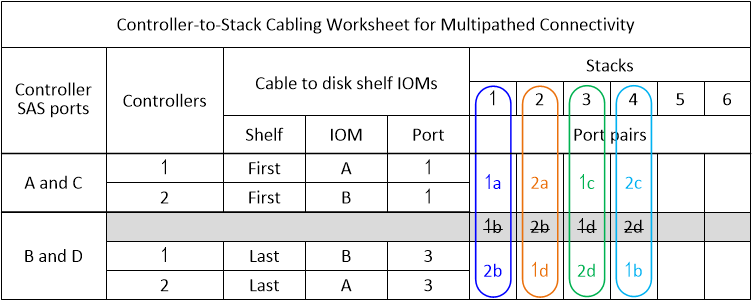

= 多路徑 HA 設定的佈線工作表 - DS212C、DS224C 或 DS460C
:allow-uri-read: 
:icons: font
:imagesdir: ../media/

[role="lead"]
您可以使用控制器到堆疊佈線工作表和佈線範例，將 HA 對佈線為多路徑 HA 進行配置。這適用於具有 IOM12/IOM12B 模組的磁碟架。

NOTE: 此資訊適用於沒有內部儲存設備的平台。

* 如有需要、請參閱 link:install-cabling-rules.html["SAS 纜線規則與概念"] 如需支援組態的相關資訊、請參閱控制器插槽編號慣例、機櫃對機櫃連線、以及控制器對機櫃連線（包括使用連接埠配對）。
* 如有需要、請參閱 link:install-cabling-worksheets-how-to-read-multipath.html["如何讀取工作表以纜線連接控制器與堆疊的連線、以實現多路徑連線"]。
* 佈線範例顯示控制器對堆疊纜線為實線或虛線、以區分控制器A和C連接埠連線與控制器B和D連接埠連線。
+
image::../media/drw_controller_to_stack_cable_type_key.gif[多重路徑 HA 組態纜線類型金鑰]

* 佈線範例中的纜線及工作表中對應的連接埠配對會以色彩編碼、以區分與HA配對中每個堆疊的連線。
+
image::../media/drw_controller_to_stack_cable_color_key_non2600_4stackcolors.gif[多重路徑 HA 組態纜線彩色金鑰]

* 工作表和佈線範例會依照工作表中列出的順序來顯示佈線連接埠配對。

== 控制器對堆疊佈線工作表和佈線範例、適用於使用四埠SAS HBA的多重路徑HA組態

您可以使用完整的控制器對堆疊佈線工作表和佈線範例、來連接具有四埠SAS HBA的一般多重路徑HA組態。這些控制器沒有內建SAS連接埠。

=== 多重路徑HA：一個四埠SAS HBA和一個單一機櫃堆疊

下列工作表和纜線範例使用連接埠配對1a/1d：

image::../media/drw_worksheet_mpha_slot_1_one_4porthba_one_singleshelf_stack.gif[一個四埠 SAS HBA 和一個單一機櫃堆疊的多重路徑 HA 纜線工作表]

image::../media/drw_mpha_slot_1_one_4porthba_one_singleshelf_stack.gif[一個四埠 SAS HBA 和一個單一機櫃堆疊的多重路徑 HA 纜線範例]

=== 多重路徑HA、搭配一個四埠SAS HBA和兩個單一機櫃堆疊

下列工作表和纜線範例使用連接埠配對1a/1d和1c/1b：

image::../media/drw_worksheet_mpha_slot_1_one_4porthba_two_singleshelf_stacks.gif[一個四埠 SAS HBA 和兩個單一機櫃堆疊的多重路徑 HA 纜線工作表]

image::../media/drw_mpha_slot_1_one_4porthba_two_singleshelf_stacks.gif[一個四埠 SAS HBA 和兩個單一機櫃堆疊的多重路徑 HA 纜線範例]

=== 多重路徑HA、含兩個四埠SAS HBA和兩個多重機櫃堆疊

此組態提供四個連接埠配對：1A/2b、2a/1d、1c/2D和2c/1b。您可以依照連接埠配對的識別順序（列於工作表）來連接連接連接埠配對、也可以連接其他連接埠配對（跳過連接埠配對）。

NOTE: 如果連接埠配對數量超過系統中的堆疊纜線數量、最佳做法是跳過連接埠配對、以最佳化系統上的SAS連接埠。藉由最佳化SAS連接埠、您可以最佳化系統效能。

下列工作表和纜線佈線範例顯示使用連接埠配對的順序、請參閱工作表：1A/2b、2a/1d、1c/2D和2c/1b。

image::../media/drw_mpha_slots_1_and_2_4porthbas_4_stacks.gif[兩個四埠 SAS HBA 和兩個多機櫃堆疊的多重路徑 HA 纜線範例]

下列工作表和佈線範例顯示要跳過的連接埠配對、以供清單中的每一個使用：1A/2b和1c/2D。

NOTE: 如果稍後新增了第三個堆疊、您就會使用跳過的連接埠配對。

image::../media/drw_worksheet_mpha_slots_1_and_2_two_4porthbas_two_stacks_skipped.gif[使用跳過的連接埠配對、用於兩個四埠 SAS HBA 和兩個多機櫃堆疊的多重路徑 HA 纜線工作表]

image::../media/drw_mpha_slots_1_and_2_two_4porthbas_two_stacks_skipped.gif[使用跳過的連接埠配對、用於兩個四埠 SAS HBA 和兩個多機櫃堆疊的多重路徑 HA 纜線範例]

== 控制器對堆疊佈線工作表和佈線範例、適用於具有四個內建SAS連接埠的多重路徑HA組態

您可以使用完整的控制器對堆疊纜線工作表和纜線佈線範例、來連接具有四個內建SAS連接埠的一般多重路徑HA組態。

=== 多重路徑HA具備四個內建SAS連接埠和一個單一機櫃堆疊

以下工作表和佈線範例使用連接埠配對0A/0d：

image::../media/drw_worksheet_mpha_slot_0_4ports_one_singleshelf_stack.gif[四個內建連接埠和一個單一機櫃堆疊的多重路徑 HA 纜線工作表]

image::../media/drw_mpha_slot_0_4ports_one_singleshelf_stack.gif[四個內建連接埠和一個單一機櫃堆疊的多重路徑 HA 纜線範例]

=== 多重路徑HA具備四個內建SAS連接埠和兩個單一機櫃堆疊

以下工作表和佈線範例使用連接埠配對0A/0d和0c/0b：

image::../media/drw_worksheet_mpha_slot_0_4ports_two_singleshelf_stacks.gif[四個內建連接埠和兩個單一機櫃堆疊的多重路徑 HA 纜線工作表]

image::../media/drw_mpha_slot_0_4ports_two_singleshelf_stacks.gif[四個內建連接埠和兩個單一機櫃堆疊的多重路徑 HA 纜線範例]

=== 多重路徑HA具備四個內建SAS連接埠、四埠SAS HBA和兩個多重機櫃堆疊

此組態提供四個連接埠配對：0A/1b、1a/0d、0c/1d和1c/0b。您可以依照連接埠配對的識別順序（列於工作表）來連接連接連接埠配對、也可以連接其他連接埠配對（跳過連接埠配對）。

NOTE: 如果連接埠配對數量超過系統中的堆疊纜線數量、最佳做法是跳過連接埠配對、以最佳化系統上的SAS連接埠。藉由最佳化SAS連接埠、您可以最佳化系統效能。

下列工作表和纜線佈線範例顯示使用連接埠配對的順序、請參閱工作表：0A/1b、1a/0d、0c/1d和1c/0b。

image::../media/drw_worksheet_mpha_slots_0_and_1_8ports_4stacks.gif[多重路徑 HA 纜線工作表、適用於四埠 SAS HBA 和兩個多機櫃堆疊的四個內建 SAS 連接埠]

image::../media/drw_mpha_slots_0_and_1_8ports_4_stacks.gif[多重路徑 HA 纜線範例、適用於四埠 SAS HBA 和兩個多機櫃堆疊的四個內建 SAS 連接埠]

以下工作表和佈線範例顯示跳過連接埠配對、以便在清單中每隔一組使用：0A/1b和0c/1d。

NOTE: 如果稍後新增了第三個堆疊、您就會使用跳過的連接埠配對。

image::../media/drw_worksheet_mpha_slots_0_and_1_8ports_two_stacks_skipped.gif[多重路徑 HA 纜線工作表適用於四個內建連接埠、四埠 SAS HBA 、以及使用略過連接埠配對的兩個多機櫃堆疊]

image::../media/drw_mpha_slots_0_and_1_8ports_two_stacks_skipped.gif[多重路徑 HA 纜線範例：四個內建連接埠、一個四埠 SAS HBA 、以及兩個使用略過連接埠配對的多機櫃堆疊]
