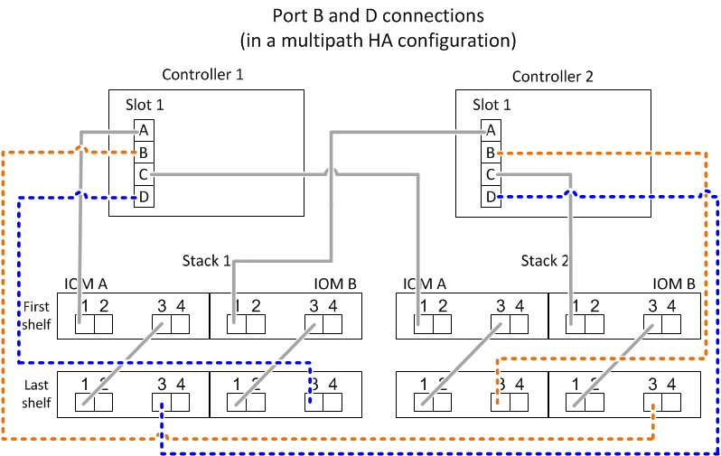

= SAS纜線配置規則：採用IOM12/IOM12B模組的機櫃
:allow-uri-read: 
:icons: font
:imagesdir: ../media/

[role="lead"]
採用IOM12/IOM12B模組的磁碟櫃、可透過套用SAS纜線規則、組態規則、控制器插槽編號規則、機櫃對機櫃連線規則、控制器對堆疊連線規則、以及適用的Mini-SAS HD SAS光纖纜線規則、以HA配對和單一控制器組態（適用於支援的平台）進行纜線。

NOTE: 本指南所述的控制器插槽編號規則、機櫃對機櫃連線規則、以及控制器對堆疊連線規則、均與適用於所有SAS磁碟櫃的相同規則相同、無論它們具有IOM12/IOM12B、IOM6或IOM3模組。然而、本指南所提供的資訊、是針對採用IOM12模組的磁碟櫃的獨特特性、以及在支援的組態中使用這些模組。

本指南所述的SAS纜線配置規則與Mini-SAS HD SAS光纖纜線規則、是特定於採用IOM12/IOM12B模組的磁碟櫃。

本指南所述的SAS纜線佈線規則、可平衡內建SAS連接埠與主機匯流排介面卡SAS連接埠之間的SAS纜線、以提供高可用度的儲存控制器組態、並符合下列目標：

* 針對所有SAS產品和組態、提供易於理解的單一通用演算法
* 產生物料清單（BOM）時、請產生相同的實體纜線、然後在工廠和現場進行
* 可透過組態檢查軟體和工具進行驗證
* 提供最大可能的恢復能力、以維持可用度、並將對控制器移轉的依賴程度降至最低

您應該避免偏離規則、因為差異可能會降低可靠性、普遍性和通用性。

== 組態規則

特定類型的HA配對和單一控制器組態支援含有IOM12模組的磁碟櫃。

NOTE: 本內容未說明FAS25XX平台的問題。

* HA配對組態必須以多重路徑HA或四重路徑HA組態進行纜線連接、但有下列例外：
+
** 內含內部儲存設備的平台、包括FAS2600系列、AFF EFASA200、FAS2700系列、AFF E4A220、 之後、也可以將纜線連接成單一路徑HA組態、以支援連線至外部SAS磁帶備份裝置。
** 內含內部儲存設備的平台、包括FAS2600系列、AFF EFASA200、FAS2700系列、AFF E4A220、 之後、不支援四路徑HA連線。

* 單一控制器組態必須以多重路徑或四重路徑組態進行纜線連接、但有下列例外：
+
** FAS2600系列單一控制器組態（含外部磁碟櫃）可以單一路徑組態進行纜線連接。
+
由於內部儲存設備使用單一路徑連線功能、ONTAP 因此導致無法偵測到混合路徑時、出現一些偶爾出現的警告。為了避免這些警告、您可以使用單一路徑連線到外部磁碟櫃。此外、您也可以在使用外部SAS磁帶備份設備時、使用單一路徑連線功能。

** FAS2600系列單控制器組態不支援四路徑連線。

== 控制器插槽編號規則

為了在所有支援的HA配對和單一控制器組態中套用纜線佈線規則、我們會使用控制器插槽編號慣例。

* 對於所有HA配對和單一控制器組態、適用下列項目：
+
** 實體PCI插槽中的SAS HBA定義為佔用PCI插槽1、2、3等、無論控制器上的插槽實體標籤為何。
+
例如、如果SAS HBA佔用實體PCI插槽3、5和7、就會指定為插槽1、2和3、以套用SAS纜線規則。

** 內建SAS HBA的定義是佔用PCI插槽0、如同控制器上標示的一樣。
** 每個插槽中的每個連接埠的定義方式、與控制器上標示的方式一樣。例如、有兩個連接埠的插槽0稱為0A和0b。插槽1含四個連接埠、稱為1a、1b、1c和1d。
+
本文檔中的插槽和插槽端口如下所示：

+
image::../media/slot0_rules.png[SLOT0規則]

== 機櫃對機櫃連線規則

當您在磁碟櫃堆疊中有多個磁碟櫃時、它們會使用適用的「標準」或「雙寬」磁碟櫃對磁碟櫃佈線、透過每個SAS網域（IOM A和IOM B）相互連接。您使用「標準」或「雙寬」的機櫃對機櫃佈線取決於您的組態。

=== 標準機櫃對機櫃連線能力

* 標準機櫃對機櫃連線功能可用於多重路徑HA、多重路徑、單一路徑HA和單一路徑組態。
* 標準的機櫃對機櫃連線功能是目前使用IOM3和IOM6模組的SAS儲存組態：每個網域中的磁碟機櫃（IOM A）和網域B（IOM B）之間需要一條纜線連線。
* 最佳實務做法是使用IOM連接埠3和1進行標準的機櫃對機櫃連線。
+
從邏輯的第一個機櫃到堆疊中的邏輯最後一個機櫃、您可以將IOM連接埠3連接到網域A中的下一個機櫃IOM連接埠1、然後連接到網域B

image::../media/drw_shelf_to_shelf_standard.gif[從磁碟櫃到磁碟櫃的標準]

=== 雙寬機櫃對機櫃連線能力

* 雙寬磁碟櫃對磁碟櫃連線可用於四路徑（四路徑HA和四路徑）組態。
* 雙寬型機櫃對機櫃連線需要在每個網域的磁碟櫃之間建立兩條纜線連線、分別是網域A（IOM A）和網域B（IOM B）。
+
第一條纜線連接是以標準的機櫃對機櫃連線（使用IOM連接埠3和1）連接；第二條纜線連接是以雙寬機櫃對機櫃連線方式（使用IOM連接埠4和2）連接。

+
從邏輯的第一個機櫃到堆疊中的邏輯最後一個機櫃、您可以將IOM連接埠3連接到網域A中的下一個機櫃IOM連接埠1、然後連接到網域B從邏輯的第一個機櫃到堆疊中的邏輯最後一個機櫃、您可以將IOM連接埠4連接到網域A中的下一個機櫃的IOM連接埠2、然後連接到網域B（以雙寬連線方式連接的IOM連接埠顯示為藍色。）

image::../media/drw_shelf_to_shelf_double_wide.gif[將磁碟櫃放在雙寬的磁碟櫃上]

== 控制器對堆疊連線規則

您可以正確地將SAS連線從每個控制器連接至HA配對或單一控制器組態中的每個堆疊、方法是瞭解SAS磁碟櫃使用軟體磁碟擁有權、控制器連接埠A/C和B/D如何連接至堆疊、 控制器連接埠A/C和B/D如何組織成連接埠配對、以及採用內部儲存設備的平台如何將其控制器連接埠連接至堆疊。

=== SAS磁碟櫃軟體型磁碟擁有權規則

SAS磁碟櫃使用軟體型磁碟擁有權（而非硬體型磁碟擁有權）。這表示磁碟機擁有權儲存在磁碟機上、而非由儲存系統實體連線的拓撲所決定（如同硬體型磁碟擁有權）。具體而言、磁碟機所有權是由ONTAP 支援（自動或CLI命令）指派、而非由控制器與堆疊連線的纜線方式指派。

SAS磁碟櫃切勿使用硬體型磁碟擁有權配置來進行纜線連接。

=== 控制器A和C連接埠連線規則（適用於沒有內部儲存設備的平台）

* A和C連接埠永遠是堆疊的主要路徑。
* A和C連接埠一律連接至堆疊中的邏輯第一個磁碟櫃。
* A和C連接埠一律連接至磁碟櫃IOM連接埠1和2。
+
IOM連接埠2僅用於四路徑HA和四路徑組態。

* 控制器1 A和C連接埠一律連線至IOM A（網域A）。
* 控制器2 A和C連接埠一律連線至IOM B（網域B）。

下圖重點說明控制器連接埠A和C如何以一個四埠HBA和兩個磁碟櫃堆疊的多重路徑HA組態進行連線。與堆疊1的連線顯示為藍色。堆疊2的連線顯示為橘色。

image::../media/drw_controller_to_stack_rules_ports_a_and_c_example.gif[以堆疊規則連接埠A和c為例的DRW控制器]

=== 控制器B和D連接埠連線規則（適用於沒有內部儲存設備的平台）

* B和D連接埠永遠是堆疊的次要路徑。
* B和D連接埠一律連接至堆疊中的邏輯最後一個磁碟櫃。
* B和D連接埠一律連接至磁碟櫃IOM連接埠3和4。
+
IOM連接埠4僅用於四路徑HA和四路徑組態。

* 控制器1 B和D連接埠一律連線至IOM B（網域B）。
* 控制器2 B和D連接埠一律連線至IOM A（網域A）。
* B和D連接埠會將PCI插槽的順序偏移一個、以便第一個插槽上的第一個連接埠最後連接。

下圖重點說明控制器連接埠B和D如何以一個四埠HBA和兩個磁碟櫃堆疊的多重路徑HA組態進行連線。與堆疊1的連線顯示為藍色。堆疊2的連線顯示為橘色。

=== 連接埠配對連線規則（適用於沒有內部儲存設備的平台）

控制器SAS連接埠A、B、C和D會組織成連接埠配對、並使用一種方法來利用所有SAS連接埠、在HA配對和單一控制器組態中進行控制器對堆疊連線時、提供系統恢復能力和一致性。

* 連接埠配對包含控制器A或C SAS連接埠、以及控制器B或D SAS連接埠。
+
A和C SAS連接埠可連接至堆疊中的邏輯第一個機櫃。B和D SAS連接埠可連接至堆疊中的邏輯最後一個機櫃。

* 連接埠配對使用系統中每個控制器上的所有SAS連接埠。
+
您可以將所有SAS連接埠（在HBA上的實體PCI插槽[插槽1-N]和主機板上的控制器[插槽0]）整合為連接埠配對、藉此提高系統恢復能力。請勿排除任何SAS連接埠。

* 連接埠配對的識別和組織方式如下：
+
.. 依插槽順序列出連接埠、然後列出C連接埠（0、1、2、3等）。
+
例如：1A、2a、3a、1c、2c、 3c

.. 依插槽順序列出B連接埠和D連接埠（0、1、2、3等）。
+
例如：1B、2b、3b、1d、2D、 3D

.. 重新寫入D和B連接埠清單、將清單中的第一個連接埠移到清單的結尾。
+
例如： image:../media/drw_gen_sas_cable_step2.png[""]

+
當有多個SAS連接埠插槽可用時、一個插槽的順序會在多個插槽（實體PCI插槽和主機板插槽）之間平衡連接埠配對、因此無法將堆疊連接至單一SAS HBA。

.. 將A和C連接埠（在步驟1中列出）與D和B連接埠（在步驟2中列出）配對、並依照它們列出的順序進行配對。
+
例如：1A/2b、2a/3b、3a/1d、1c/2D、2c/3D、3c/1b。

+

NOTE: 對於HA配對、您為第一個控制器識別的連接埠配對清單也適用於第二個控制器。

* 在佈線系統時、您可以依照識別順序使用連接埠配對、也可以跳過連接埠配對：
+
** 當需要所有連接埠配對來連接系統中的堆疊時、請依照您識別（列出）的順序使用連接埠配對。
+
例如、如果您為系統識別六個連接埠配對、而且有六個堆疊連接至纜線作為多重路徑、則您可以依照列出的順序來連接連接埠配對：

+
1A/2b、2a/3b、3a/1d、1c/2D、2c/3D、3c/1b

** 當系統中的堆疊不需要所有連接埠配對時、請跳過連接埠配對（使用其他連接埠配對）。
+
例如、如果您為系統識別六個連接埠配對、並將三個堆疊連接至纜線作為多重路徑、則您可以在清單中連接其他連接埠配對：

+
image::../media/drw_portpair_connection_rules_list_skip.gif[不顯示DRw連接規則列表]

+

NOTE: 如果連接埠配對數量超過系統中的堆疊纜線數量、最佳做法是跳過連接埠配對、以最佳化系統上的SAS連接埠。藉由最佳化SAS連接埠、您可以最佳化系統效能。

控制器對堆疊佈線工作表是識別及組織連接埠配對的便利工具、可讓您將控制器對堆疊連線纜線連接至HA配對或單一控制器組態。

link:install-cabling-worksheet-template-multipath.html["用於多路徑連線的控制器對堆疊佈線工作表範本"]

link:install-cabling-worksheet-template-quadpath.html["控制器對堆疊佈線工作表範本、提供四路徑連線功能"]

=== 控制器0b和0A連接埠連線規則、適用於具有內部儲存設備的平台

內含內部儲存設備的平台、包括FAS2600系列、AFF EFASA200、FAS2700系列、AFF E4A220、 之後的連線規則也會是一組獨特的規則、因為每個控制器必須在內部儲存設備（連接埠0b）和堆疊之間維持相同的網域連線。這表示當控制器位於機箱（控制器1）的插槽A時、它位於網域A（IOM A）中、因此連接埠0b必須連接至堆疊中的IOM A。當控制器位於機箱（控制器2）的插槽B時、它位於網域B（IOM B）中、因此連接埠0b必須連接至堆疊中的IOM B。

NOTE: FAS25XX平台未在此內容中說明。

NOTE: 如果您未將0b連接埠連接至正確的網域（跨連線網域）、則系統會面臨恢復問題、使您無法安全執行不中斷營運的程序。

* 控制器0b連接埠（內部儲存連接埠）：
+
** 控制器1 0b連接埠永遠連線至IOM A（網域A）。
** 控制器2 0b連接埠一律連線至IOM B（網域B）。
** 連接埠0b永遠是主要路徑。
** 連接埠0b一律會連線至堆疊中的邏輯最後一個磁碟櫃。
** 連接埠0b一律連線至磁碟櫃IOM連接埠3。

* 控制器0A連接埠（內部HBA連接埠）：
+
** 控制器1 0A連接埠永遠連線至IOM B（網域B）。
** 控制器2 0A連接埠永遠連線至IOM A（網域A）。
** 連接埠0A永遠是次要路徑。
** 連接埠0A永遠會連接至堆疊中的邏輯第一個磁碟櫃。
** 連接埠0A永遠連接磁碟櫃IOM連接埠1。

下圖重點介紹FAS2600系列、AFF E4A200、FAS2700系列、AFF EVA220及更新版本的多重路徑HA組態的內部儲存連接埠（0b）網域連線：

image::../media/drw_fas2600_mpha_domain_example.png[DRW fas2600 mpha網域範例]

== Mini-SAS HD SAS光纖纜線規則

您可以使用迷你SAS HD SAS光纖纜線：多重模式主動式光纖纜線（AOC）纜線搭配迷你SAS HD對Mini SAS HD連接器、以及多重模式（OM4）中斷纜線搭配Mini-SAS HD對LC連接器、以實現長距離SAS連線、適用於具有IOM12模組磁碟櫃的特定組態。

* 您的平台和版本ONTAP 的支援必須支援使用Mini-SAS HD SAS光纖纜線：多重模式主動式光纖纜線（AOC）纜線、搭配迷你SAS HD對Mini-SAS HD連接器、以及多重模式（OM4）中斷纜線與Mini-SAS HD對LC連接器。
+
https://hwu.netapp.com["NetApp Hardware Universe"]

* SAS光學多重模式AOC纜線搭配迷你SAS HD對迷你SAS HD連接器、可用於控制器對堆疊和機櫃對機櫃連線、長度最長可達50公尺。
* 如果您使用SAS光纖多重模式（OM4）中斷纜線搭配Mini-SAS HD對LC連接器（適用於配線面板）、則適用下列規則：
+
** 您可以使用這些纜線進行控制器對堆疊和機櫃對機櫃的連線。
+
如果您使用多重模式中斷纜線進行機櫃對機櫃連線、則只能在磁碟櫃堆疊中使用一次。您必須使用多重模式AOC纜線來連接其餘的機櫃對機櫃連線。

+
對於四路徑HA和四路徑組態、如果您使用多重模式中斷纜線來連接兩個磁碟櫃之間的磁碟櫃對磁碟櫃雙寬連線、最佳做法是使用配對相同的中斷纜線。

** 您必須將全部八（四對）LC中斷連接器連接至跳接面板。
** 您需要提供配線面板和面板間纜線。
+
面板間纜線的模式必須與中斷纜線相同：OM4多重模式。

** 一條路徑最多可使用一對配線面板。
** 任何多重模式纜線的點對點（迷你SAS HD對迷你SAS HD）路徑不得超過100公尺。
+
路徑包括一組中斷連接線、跳接面板和面板間連接線。

** 端點對端點路徑（從控制器到最後一個機櫃的點對點路徑總和）總計不得超過300公尺。
+
總路徑包括一組中斷纜線、跳線面板和面板間纜線。

* SAS纜線可以是SAS銅線、SAS光纖或混合式。
+
如果您混合使用SAS銅線和SAS光纖纜線、則適用下列規則：

+
** 堆疊中的機櫃對機連接必須是所有SAS銅線或所有SAS光纖纜線。
** 如果機櫃對機櫃連線是SAS光纖纜線、則控制器對堆疊連至該堆疊的連線也必須是SAS光纖纜線。
** 如果機櫃對機櫃連線是SAS銅線、則控制器對堆疊連至該堆疊的連線可以是SAS光纖纜線或SAS銅線。

