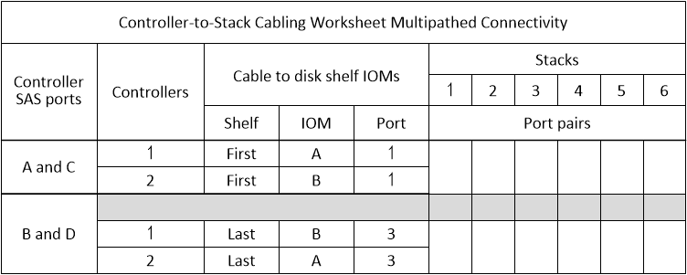

= 用於多路徑連線的控制器對堆疊佈線工作表範本-具有IOM12/IOM12B模組的磁碟櫃
:allow-uri-read: 
:icons: font
:imagesdir: ../media/

[role="lead"]
完成工作表範本之後、即可定義控制器SAS連接埠配對、以便將控制器連接至使用IOM12/IOM12B模組的磁碟櫃堆疊、以在HA配對或單一控制器組態中實現多路徑連線。您也可以使用完成的工作表、引導自己完成組態的多路徑連線。

.開始之前
如果您的平台具有內部儲存設備、請使用下列工作表：

link:install-cabling-worksheets-examples-fas2600.html["具有內部儲存設備之平台的控制器對堆疊佈線工作表和佈線範例"]

.關於這項工作
* 此程序和工作表範本適用於將多重路徑HA或多重路徑組態與一或多個堆疊進行纜線連接。
+
多重路徑HA和多重路徑組態的工作表範例已完成。

+
工作表範例使用兩個四埠SAS HBA的組態、以及兩個具有IOM12/IOM12B模組的磁碟櫃堆疊。

* 工作表範本最多可容納六個堆疊、如有需要、您需要新增更多欄。
* 如有需要、請參閱 link:install-cabling-rules.html["SAS 纜線規則與概念"] 如需支援組態的相關資訊、請參閱控制器插槽編號慣例、機櫃對機櫃連線、以及控制器對機櫃連線（包括使用連接埠配對）。
* 如有需要、請在完成工作表後參閱 link:install-cabling-worksheets-how-to-read-multipath.html["如何讀取工作表以纜線連接控制器與堆疊的連線、以實現多路徑連線"]

.步驟
. 在灰色方塊上方的方塊中、列出系統上的所有SAS A連接埠、然後依插槽順序列出系統上的所有SAS C連接埠（0、1、2、3等）。
+
例如：1A、2a、1c、2c

. 在灰色方塊中、列出系統上的所有SAS B連接埠、然後依插槽順序列出系統上的所有SAS D連接埠（0、1、2、3等）。
+
例如：1B、2b、1d、2D

. 在灰色方塊下方的方塊中、重新寫入D和B連接埠清單、以便將清單中的第一個連接埠移到清單的結尾。
+
例如：2B、一維、二維、1b

. 為每個堆疊圈選（指定）一個連接埠配對。
+
當所有連接埠配對都用於連接系統中的堆疊時、請依照工作表中定義（列出）的順序、將連接埠配對圈起來。

+
例如、在具有八個SAS連接埠和四個堆疊的多重路徑HA組態中、連接埠配對1a/2b連接至堆疊1、連接埠配對2a/1d連接至堆疊2、連接埠配對1c/2D連接至stack3、連接埠配對2c/1b連接至堆疊4。

+
image::../media/drw_worksheet_mpha_slots_1_and_2_two_4porthbas_two_stacks.gif[Drw工作表mpha插槽1和2個4porthbas兩個堆疊]

+
當系統中的堆疊不需要所有連接埠配對時、請跳過連接埠配對（使用其他連接埠配對）。

+
例如、在具有八個SAS連接埠和兩個堆疊的多重路徑HA組態中、連接埠配對1a/2b連接至堆疊1、而連接埠配對1c/2D連接至堆疊2。如果稍後熱新增兩個額外堆疊、連接埠配對2a/1d會連接至堆疊3、而連接埠配對2c/1b則會連接至堆疊4。

+

NOTE: 如果連接埠配對數量超過系統中的堆疊纜線數量、最佳做法是跳過連接埠配對、以最佳化系統上的SAS連接埠。藉由最佳化SAS連接埠、您可以最佳化系統效能。

+
image::../media/drw_worksheet_mpha_skipped_template.gif[已跳過的範本已跳過網路工作表mpha]

+
您可以使用完整的工作表單來連接系統。

. 如果您有單一控制器（多重路徑）組態、請將控制器2的資訊橫向顯示出來。
+
image::../media/drw_worksheet_mp_template.gif[DRW工作表MP範本]

+
您可以使用完整的工作表單來連接系統。

