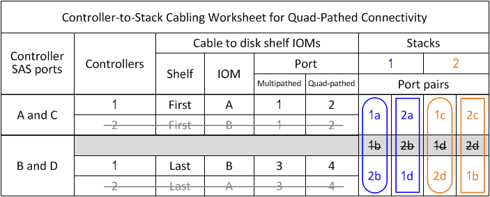

= 控制器對堆疊佈線工作表範本、提供四路徑連線功能：機櫃採用IOM12模組
:allow-uri-read: 
:icons: font
:imagesdir: ../media/

[role="lead"]
完成工作表範本之後、您就可以定義控制器SAS連接埠配對、以便將控制器連接至具有IOM12模組的磁碟櫃堆疊、以在HA配對或單一控制器組態中實現四路徑連線。您也可以使用完成的工作表、逐步引導自己完成組態的四路徑連線。

.關於他的工作
* 此程序和工作表範本適用於使用一或多個堆疊進行四路徑HA或四路徑組態的四路徑連線。
+
四路徑HA和四路徑組態的工作表已完成範例。

+
工作表範例使用兩個四埠SAS HBA和兩個磁碟櫃堆疊的組態、其中包含IOM12模組。

* 工作表範本最多可容納兩個堆疊、如有需要、您需要新增更多欄。
* 控制器對堆疊連線的四路徑連線由兩組多路徑纜線組成：第一組纜線稱為「多路徑」；第二組纜線稱為「四路徑」。
+
第二組纜線稱為「四路徑」、因為完成這組纜線之後、您就能在HA配對或單一控制器組態中、從控制器連接到堆疊、達到四路徑連線。

* 磁碟櫃IOM連接埠1和3一律用於多路徑纜線、而IOM連接埠2和4則一律用於四路徑纜線、如工作表欄標題所指定。
* 在工作表範例中、連接埠配對是指定用於連接多路徑纜線或連接至適用堆疊的四路徑纜線。
+
指定用於多路徑纜線的每個連接埠配對都會以一個圓形圈圈圈、其顏色與連接的堆疊相關。每個指定用於四路徑纜線的連接埠配對都會以矩形圈選、矩形是與其纜線堆疊相關的色彩。堆疊1與藍色有關；堆疊2與橘色有關。

* 如有需要、請參閱 link:install-cabling-rules.html["SAS纜線配置規則"] 如需控制器插槽編號慣例、機櫃對機櫃連線及控制器對機櫃連線（包括使用連接埠配對）的相關資訊。
* 如有需要、請在完成工作表後參閱 link:install-cabling-worksheets-how-to-read-quadpath.html["如何讀取工作表以纜線連接控制器與堆疊的連線、以實現四路徑連線"]。

image::../media/drw_worksheet_quad_pathed_template_nau.gif[DRw工作表四路徑範本NAU]

.步驟
. 在灰色方塊上方的方塊中、列出系統上的所有SAS A連接埠、然後依插槽順序列出系統上的所有SAS C連接埠（0、1、2、3等）。
+
例如：1A、2a、1c、2c

. 在灰色方塊中、列出系統上的所有SAS B連接埠、然後依插槽順序列出系統上的所有SAS D連接埠（0、1、2、3等）。
+
例如：1B、2b、1d、2D

. 在灰色方塊下方的方塊中、重新寫入D和B連接埠清單、以便將清單中的第一個連接埠移到清單的結尾。
+
例如：2B、一維、二維、1b

. 在第一組連接埠配對四周畫一個橢圓形、在第二組連接埠配對四周畫一個矩形、以識別要連接至堆疊1的兩組連接埠配對。
+
這兩組纜線都是為了在HA配對或單一控制器組態中、實現從每個控制器到堆疊1的四路徑連線。

+
下列範例使用連接埠配對1a/2b進行多路徑纜線、而使用連接埠配對2a/1d進行四路徑纜線至堆疊1。

+
image::../media/drw_worksheet_qpha_slots_1_and_2_two_4porthbas_two_stacks_set1_circled_nau.gif[Drw工作表qpha插槽1和2個4porthbas兩個堆疊、設定1個圈出的NAU]

. 在第一組連接埠配對四周畫一個橢圓形、在第二組連接埠配對四周畫一個矩形、以識別要連接至堆疊2的兩組連接埠配對。
+
這兩組纜線都是為了在HA配對或單一控制器組態中、實現從每個控制器到堆疊1的四路徑連線。

+
下列範例使用連接埠配對1c/2D進行多路徑纜線、使用連接埠配對2c/1b進行四路徑纜線至堆疊2。

+
image::../media/drw_worksheet_qpha_slots_1_and_2_two_4porthbas_two_stacks_nau.gif[Drw工作表qpha插槽1和2個4porthbas雙堆疊NAU]

. 如果您有四路徑（單控制器）組態、請將控制器2的資訊橫向傳送出去；您只需要控制器1的資訊、就能將控制器與堆疊的連線纜線。
+
以下範例顯示控制器2的資訊已刪去。

+

