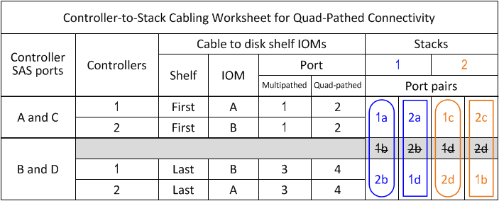

= 如何閱讀工作表、將控制器對堆疊的連線纜線連接到具有四路徑連線的磁碟櫃、並使用IOM12模組
:allow-uri-read: 
:icons: font
:imagesdir: ../media/

[role="lead"]
您可以使用此範例來引導您瞭解如何使用IOM12模組來讀取完整的工作表、並將其套用至磁碟櫃的纜線堆疊、以進行四路徑連線。

.關於這項工作
* 本程序參考下列工作表和纜線佈線範例、示範如何讀取工作表來連接控制器與堆疊的纜線連接。
+
本範例所使用的組態為四路徑HA組態、每個控制器上有兩個四埠SAS HBA、以及兩個具有IOM12模組的磁碟櫃堆疊。

* 如果您使用單一控制器組態、請跳過子步驟b和d、以便連接至第二個控制器。
* 如有需要、請參閱 link:install-cabling-rules.html["SAS纜線配置規則"] 如需控制器插槽編號慣例、機櫃對機櫃連線及控制器對機櫃連線（包括使用連接埠配對）的相關資訊。

image::../media/drw_qpha_slots_1_and_2_two_4porthbas_two_stacks_nau.gif[Drw qpha插槽1和2兩個4porthbas兩個堆疊NAU]

.步驟
. 每個控制器上的纜線連接埠配對1a/2b至堆疊1：
+
這是堆疊1的多路徑纜線。

+
.. 纜線控制器1連接埠1A連接至堆疊1、第一個機櫃IOM A連接埠1。
.. 纜線控制器2連接埠1A連接至堆疊1、第一個機櫃IOM B連接埠1。
.. 纜線控制器1連接埠2b至堆疊1、最後一個機櫃IOM B連接埠3。
.. 纜線控制器2連接埠2b至堆疊1、最後一個機櫃IOM A連接埠3。

. 每個控制器的纜線連接埠配對2a/1d至堆疊1：
+
這是堆疊1的四路徑纜線。一旦完成、堆疊1就能與每個控制器建立四路徑連線。

+
.. 纜線控制器1連接埠2a連接至堆疊1、第一個機櫃IOM A連接埠2。
.. 纜線控制器2連接埠2a連接至堆疊1、第一個機櫃IOM B連接埠2。
.. 纜線控制器1埠1d至堆疊1、最後一個機櫃IOM B連接埠4。
.. 纜線控制器2連接埠1d至堆疊1、最後一個機櫃IOM A連接埠4。

. 每個控制器的纜線連接埠配對1c/2D至堆疊2：
+
這是堆疊2的多路徑纜線。

+
.. 纜線控制器1連接埠1c至堆疊2、第一個機櫃IOM A連接埠1。
.. 纜線控制器2連接埠1c至堆疊2、第一個機櫃IOM B連接埠1。
.. 纜線控制器1連接埠2D到堆疊2、最後一個機櫃IOM B連接埠3。
.. 纜線控制器2連接埠2D到堆疊2、最後一個機櫃IOM A連接埠3。

. 每個控制器的纜線連接埠配對2c/1b至堆疊2：
+
這是堆疊2的四路徑纜線。一旦完成、堆疊2就能與每個控制器建立四路徑連線。

+
.. 纜線控制器1連接埠2c至堆疊2、第一個機櫃IOM A連接埠2。
.. 纜線控制器2連接埠2c連接至堆疊2、第一個機櫃IOM B連接埠2。
.. 纜線控制器1連接埠1b連接至堆疊2、最後一個機櫃IOM B連接埠4。
.. 纜線控制器2連接埠1b至堆疊2、最後一個機櫃IOM A連接埠4。

