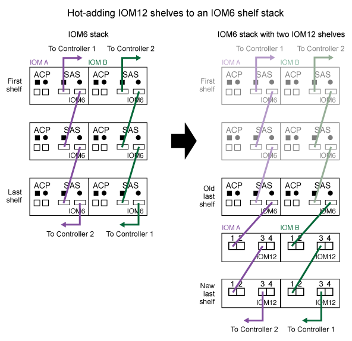

= 將IOM12/IOM12B磁碟櫃熱新增至IOM6磁碟櫃堆疊
:allow-uri-read: 
:icons: font
:imagesdir: ../media/

[role="lead"]
如果需要額外的儲存設備、您可以將IOM12/IOM12B磁碟櫃（SAS磁碟櫃搭配IOM12/IOM12B模組）熱新增至IOM6磁碟櫃堆疊（SAS磁碟櫃搭配IOM6模組）、表示您可以混合堆疊。

== 熱新增需求

在MetroCluster 將IOM12/IOM12B磁碟櫃熱新增至IOM6磁碟櫃堆疊之前、HA配對、單一控制器或延伸功能不全組態（系統）必須符合特定需求。

NOTE: 如需橋接式MetroCluster 附加的功能、請參閱 <<橋接式MetroCluster 附加功能的需求>>。

* 您的系統和版本ONTAP 的支援必須在同一個堆疊（混合堆疊）中混合使用IOM6磁碟櫃和IOM12/IOM12B磁碟櫃。
+
您可以使用下列其中一種方法來驗證支援：

+
** 在任一控制器的admin提示字元中輸入「run local sysconfig」命令。
+
如果SAS2/SAS3「混合堆疊支援」欄位未出現在輸出中、或值為「無」、則表示您的系統不支援混合堆疊。

+
如果「SAS2/SAS3混合堆疊支援」欄位中顯示「ALL」、則表示您的系統支援混合堆疊。

+
如果「SAS2/SAS3混合堆疊支援」欄位中出現「橋接附加」、則系統僅在儲存櫃透過Atto FibreBridge連接時才支援混合堆疊。

** 移至Hardware Universe 「不完整」並瀏覽至您的平台資訊。
+
https://hwu.netapp.com["NetApp Hardware Universe"^]

* 如果您要將機櫃新增MetroCluster 至某個架構、則組態必須符合MetroCluster 《安裝與組態指南》中的所有要求。
+
http://docs.netapp.com/ontap-9/topic/com.netapp.doc.dot-mcc-inst-cnfg-ip/home.html["《英文網頁IP安裝與組態指南》MetroCluster"^]

+
http://docs.netapp.com/ontap-9/topic/com.netapp.doc.dot-mcc-inst-cnfg-stretch/home.html["《》《9 Stretch《安裝與組態指南》ONTAP MetroCluster"^]

+
http://docs.netapp.com/ontap-9/topic/com.netapp.doc.dot-mcc-inst-cnfg-fabric/home.html["《支援架構的不完整安裝與組態指南》（英文）ONTAP MetroCluster"^]

* IOM6磁碟櫃堆疊（您要將IOM12/IOM12B磁碟櫃熱新增至其中）必須以SAS銅線纜線（適用於所有磁碟櫃對磁碟櫃和控制器對堆疊連線）連接。
+
混合堆疊不支援SAS光纖纜線。

+

NOTE: 如果IOM6機櫃堆疊是以任何SAS光纖纜線連接、則無法熱新增IOM12/IOM12B機櫃。請聯絡您的NetApp銷售代表。

* 您的系統必須少於支援的磁碟機數量上限、至少要有可安裝在熱新增的 IOM12/ IOM12B 機櫃中的磁碟機數量。
+
熱新增IOM12/IOM12B磁碟櫃之後、您無法超過系統支援的磁碟機數量上限。

+
https://hwu.netapp.com["NetApp Hardware Universe"^]

* 您的系統無法顯示任何SAS纜線錯誤訊息。
+
您必須使用錯誤訊息所提供的修正動作來修正任何纜線錯誤。

+
https://mysupport.netapp.com/site/tools["NetApp下載Config Advisor"^]

* 您必須訂購並收到IOM12/IOM12B磁碟櫃、以及適當數量和類型的SAS銅線。
+
IOM12/IOM12B磁碟櫃使用Mini-SAS HD連接器。IOM6磁碟櫃使用QSFP連接器。

== 橋接式MetroCluster 附加功能的需求

如果您要將IOM12/IOM12B磁碟櫃熱新增至IOM6磁碟櫃堆疊、而此磁碟櫃是以MetroCluster 一對Atto FibreBridge的方式以供進行非結構性組態連接、則系統必須符合特定需求。

* 如果目前組態中有橋接 SAS 連接埠可用、您應該將 IOM12/ IOM12B 機櫃新增為獨立的堆疊。
+
在堆疊中混合IOM12/IOM12B和IOM6模組之前、請先使用所有橋接連接埠。

* 您的系統和版本ONTAP 的支援必須在同一個堆疊（混合堆疊）中混合使用IOM6磁碟櫃和IOM12/IOM12B磁碟櫃。
+
您可以使用下列其中一種方法來驗證支援：

+
** 在任一控制器的admin提示字元中輸入「run local sysconfig」命令。
+
如果SAS2/SAS3「混合堆疊支援」欄位未出現在輸出中或值為「無」、表示您的系統不支援混合堆疊。

+
如果「SAS2/SAS3混合堆疊支援」欄位中出現其他項目、例如「全部」或「連接橋接」、則您的系統確實支援混合堆疊。

** 移至Hardware Universe 「不完整」並瀏覽至您的平台資訊。
+
https://hwu.netapp.com["NetApp Hardware Universe"^]

* 組態必須符合MetroCluster 《不完整安裝與組態指南》中的所有要求。
+
https://docs.netapp.com/us-en/ontap-metrocluster/install-stretch/index.html["安裝及設定Stretch MetroCluster 的需求擴充組態"^]

+
https://docs.netapp.com/us-en/ontap-metrocluster/install-fc/index.html["安裝及設定架構附加MetroCluster 的功能性更新組態"^]

* IOM6磁碟櫃堆疊（您要將IOM12/IOM12B磁碟櫃熱新增至其中）必須以SAS銅線纜線（適用於所有磁碟櫃對磁碟櫃和控制器對堆疊連線）連接。
+
混合堆疊不支援SAS光纖纜線。

+

NOTE: 如果IOM6機櫃堆疊是以任何SAS光纖纜線連接、則無法熱新增IOM12/IOM12B機櫃。請聯絡您的NetApp銷售代表。

* 您的組態必須少於橋接連接埠所支援的磁碟機數量上限。
* 您必須訂購並收到IOM12/IOM12B磁碟櫃、以及適當數量和類型的SAS銅線。
+
IOM12/IOM12B磁碟櫃使用Mini-SAS HD連接器。IOM6磁碟櫃使用QSFP連接器。

* 橋接器必須執行3.16/4.16版及更新版本的韌體。

== 熱新增的考量事項

在將IOM12/IOM12B磁碟櫃熱新增至IOM6磁碟櫃堆疊之前、您應該先熟悉此程序的各個層面和最佳實務做法。

=== 一般考量

* 強烈建議您要熱新增的IOM12/IOM12B磁碟櫃執行韌體版本0260或更新版本、然後再將其連接至系統。
+
如果您將熱新增的磁碟櫃錯誤地連接至堆疊、則擁有支援版本的機櫃韌體可防止儲存堆疊存取問題。

+
將IOM12/IOM12B機櫃韌體下載至機櫃之後、請在任一控制器的主控台輸入「shorage shShelfLE show -module"命令、確認韌體版本為0260或更新版本。

* 不支援不中斷的堆疊整合。
+
您無法使用此程序來熱新增磁碟櫃、這些磁碟櫃在系統開機並提供資料（I/O進行中）時、會從同一個系統的其他堆疊熱移除。

* 如果受影響的磁碟櫃有鏡射的集合體、您可以使用此程序、在同MetroCluster 一個作業系統中熱移除的熱新增磁碟櫃。
* 當您將配備 IOMM12 / IOM12B 模組的機櫃熱新增至配備 IOM6 模組的機櫃堆疊時、整個堆疊的效能會以 6 Gbps （以最低的一般速度執行）運作。
+
如果您要熱新增的機櫃是已從 IOM3 或 IOM6 模組升級至 IOM12/IOM12B 模組的機櫃、則堆疊會以 12 Gbps 的速度運作；然而、機櫃背板和磁碟功能可將磁碟效能限制為 3 Gbps 或 6 Gbps 。

* 連接好熱新增的機櫃之後ONTAP 、即可識別出機櫃：
+
** 如果啟用自動磁碟機指派、則會指派磁碟機所有權。
** 如有需要、機櫃（IOM）韌體和磁碟機韌體應會自動更新。
+

NOTE: 韌體更新最多可能需要30分鐘。

=== 最佳實務考量

* *最佳實務做法：*最佳實務做法是在熱新增機櫃之前、先在系統上安裝最新版本的機櫃（IOM）韌體和磁碟機韌體。
+
https://mysupport.netapp.com/site/downloads/firmware/disk-shelf-firmware["NetApp下載：磁碟櫃韌體"^]

+
https://mysupport.netapp.com/site/downloads/firmware/disk-drive-firmware["NetApp下載：磁碟機韌體"^]

NOTE: 請勿將韌體還原至不支援機櫃及其元件的版本。

* *最佳實務做法：*最佳實務做法是在熱新增機櫃之前、先安裝目前版本的磁碟認證套件（DQP）。
+
安裝最新版的DQP可讓您的系統辨識及使用新的合格磁碟機。如此可避免系統事件訊息、因為無法辨識磁碟機、因此無法取得非最新的磁碟機資訊並防止磁碟分割。此外、DQP也會通知您非最新的磁碟機韌體。

+
https://mysupport.netapp.com/site/downloads/firmware/disk-drive-firmware/download/DISKQUAL/ALL/qual_devices.zip["NetApp下載：磁碟認證套件"^]

* *最佳實務做法：*最佳實務做法是Active IQ Config Advisor 在熱新增機櫃之前和之後執行
+
在Active IQ Config Advisor 熱新增機櫃之前執行功能支援提供現有SAS連線的快照、驗證機櫃（IOM）韌體版本、並可讓您驗證系統上已使用的機櫃ID。熱新增機櫃後執行Active IQ Config Advisor 的功能可讓您驗證機櫃的纜線是否正確、以及系統內的機櫃ID是否獨特。

+
https://mysupport.netapp.com/site/tools["NetApp下載Config Advisor"^]

* *最佳實務做法：*最佳實務做法是在您的系統上執行頻內ACP（IBACP）。
+
** 對於執行 IBACP 的系統、 IBACP 會在熱新增的 IOM12/ IOM12B 機櫃上自動啟用。
** 對於啟用頻外 ACP 的系統、 ACP 功能無法在 IOM12/ IOM12B 機櫃上使用。
+
您應該移轉至IBACP、並移除頻外ACP纜線。

** 如果您的系統未執行IBACP、且您的系統符合IBACP的要求、則您可以在熱新增IOM12機櫃之前、將系統移轉至IBACP。
+
https://kb.netapp.com/Advice_and_Troubleshooting/Data_Storage_Systems/FAS_Systems/In-Band_ACP_Setup_and_Support["移轉至IBACP的說明"^]

+

NOTE: 移轉指示提供IBACP的系統需求。

== 準備為熱新增手動指派磁碟機擁有權

如果您要手動指派熱新增 IOM12/ IOM12B 機櫃的磁碟機擁有權、則需要停用自動磁碟機指派（如果已啟用）。

.開始之前
您必須符合系統需求。

<<熱新增需求>>

<<橋接式MetroCluster 附加功能的需求>>

.關於這項工作
如果您有HA配對、則當機櫃中的磁碟機將由兩個控制器模組擁有時、您必須手動指派磁碟機擁有權。

.步驟
. 驗證是否已啟用自動磁碟指派：「torage disk option show」
+
如果您有HA配對、可以在任一控制器模組上輸入命令。

+
如果啟用自動磁碟指派、輸出會在「Auto assign」（自動指派）欄中顯示「On」（開啟）（針對每個控制器模組）。

. 如果已啟用自動磁碟指派、請停用此功能：「torage disk option modify -node_node_name_-autodassign Off」（磁碟選項修改-node_node_name_-autodassign Off）
+
如果您有HA配對或雙節點MetroCluster 的功能不全、則必須停用兩個控制器模組上的自動磁碟機指派功能。

== 安裝熱新增的磁碟櫃

對於您要熱新增的每個機櫃、您都可以將機櫃安裝到機架、連接電源線、開啟機櫃電源、以及設定機櫃ID。

. 使用套件隨附的安裝說明來安裝磁碟櫃隨附的機架安裝套件（適用於兩柱式或四柱式機架安裝）。
+
[NOTE]
====
如果您要安裝多個磁碟櫃、則應從底部安裝至機架頂端、以獲得最佳的穩定性。

====
+
[CAUTION]
====
請勿將磁碟櫃疊裝到電信型機架中、因為磁碟櫃的重量可能會導致磁碟櫃在機架中以自己的重量收起。

====
. 使用套件隨附的安裝傳單、將磁碟櫃安裝並固定在支撐托架和機架上。
+
若要使磁碟櫃更輕、更容易操作、請移除電源供應器和I/O模組（IOM）。

+
對於DS460C磁碟櫃而言、雖然磁碟機是分開包裝的、使磁碟櫃更輕、但空的DS460C磁碟櫃仍重約132磅（60公斤）、因此移動磁碟櫃時請務必小心下列事項。

+

CAUTION: 建議您使用機械式舉升機或四人使用舉升把手、安全地搬移空的DS460C機櫃。

+
您的DS460C出貨件隨附四個可拆式起重把手（每側兩個）。若要使用起重把手、請將握把的彈片插入機櫃側邊的插槽、然後向上推、直到卡入定位。然後、當您將磁碟櫃滑到軌道上時、您可以使用指旋栓一次拔下一組握把。下圖顯示如何安裝舉升把手。

+
image::../media/drw_ds460c_handles.gif[安裝起重把手]

. 在將磁碟櫃安裝到機架之前、請先重新安裝您移除的所有電源供應器和IOM。
. 如果您要安裝DS460C磁碟櫃、請將磁碟機安裝到磁碟機抽屜中；否則、請執行下一步。
+
[NOTE]
====
請務必戴上接地於儲存機箱機箱上未上漆表面的防靜電腕帶、以避免靜電釋放。

如果無法使用腕帶、請在拿著磁碟機之前、先觸摸儲存機箱機箱上未上漆的表面。

====
+
如果您購買的是部分裝入的磁碟櫃、表示磁碟櫃所支援的磁碟機少於60個、請針對每個磁碟櫃安裝磁碟機、如下所示：

+
** 將前四個磁碟機安裝到正面插槽（0、3、6和9）。
+

NOTE: *設備故障風險：*為了確保適當的氣流並避免過熱、請務必將前四個磁碟機安裝到前插槽（0、3、6和9）。

** 對於其餘的磁碟機、請將其平均分配至每個抽屜。

下圖顯示磁碟機如何在磁碟櫃內的每個磁碟機匣中編號0至11。

image::../media/dwg_trafford_drawer_with_hdds_callouts.gif[磁碟機編號]

. 打開機櫃的頂端抽屜。
. 將磁碟機從其ESD袋中取出。
. 將磁碟機上的CAM握把垂直提起。
. 將磁碟機承載器兩側的兩個凸起按鈕對齊磁碟機承載器上磁碟機通道的對應間隙。
+
image::../media/28_dwg_e2860_de460c_drive_cru.gif[磁碟機上凸起按鈕的位置]

+
[cols="10,90"]
|===

| image:../media/legend_icon_01.png["編號 1"] | 磁碟機承載器右側的凸起按鈕 
|===
. 垂直放下磁碟機、然後向下轉動CAM握把、直到磁碟機卡入橘色釋放栓鎖下方。
. 針對藥櫃中的每個磁碟機重複上述子步驟。
+
您必須確定每個藥櫃中的插槽0、3、6和9均包含磁碟機。

. 小心地將磁碟機抽屜推回機箱。
+
|===

 a| 
image:../media/2860_dwg_e2860_de460c_gentle_close.gif["輕輕關上抽屜"]

 a| 

CAUTION: *可能的資料存取遺失：*切勿關閉藥櫃。緩慢推入抽屜、以避免抽屜震動、並造成儲存陣列損壞。

|===
. 將兩個拉桿推向中央、以關閉磁碟機抽取器。
. 對磁碟櫃中的每個藥櫃重複這些步驟。
. 連接前擋板。
+
.. 如果您要新增多個磁碟櫃、請針對您要安裝的每個磁碟櫃重複上述步驟。
.. 連接每個磁碟櫃的電源供應器：

. 先將電源線連接至磁碟櫃、使用電源線固定器將電源線固定到位、然後將電源線連接至不同的電源供應器、以獲得恢復能力。
. 開啟每個磁碟櫃的電源供應器、並等待磁碟機加速運轉。
+
.. 設定您要熱新增至HA配對或單一控制器組態中唯一ID的每個機櫃的機櫃ID。
+
有效的機櫃ID為00至99。建議您設定機櫃 ID 、使 IOM6 機櫃使用較低的數字（ 1 - 9 ）、而 IOM12/ IOM12B 機櫃使用較高的數字（ 10 個以上）。

+
如果您的平台模式具有內建儲存設備、則機櫃ID必須在內部機櫃和外部附加機櫃之間是唯一的。建議您將內部機櫃設為0。在靜態IP組態中、只會套用外部機櫃名稱、因此機櫃名稱不需要是唯一的。MetroCluster

. 如有需要、請執行Active IQ Config Advisor 功能以驗證已在使用中的機櫃ID。
+
https://mysupport.netapp.com/site/tools["NetApp下載Config Advisor"^]

+
您也可以執行「shorage sh家show -Fields sh家ID」命令、查看系統中已使用的機櫃ID清單（如果有的話、也可以複製）。

. 存取左端蓋後方的機櫃ID按鈕。
. 按住橘色按鈕、直到數位顯示器上的第一個數字開始閃爍、最多需要三秒鐘、即可變更機櫃ID的第一個數字。
. 按下按鈕以前進該號碼、直到達到所需的號碼為止。
. 針對第二個數字重複執行子步驟c和d。
. 按住按鈕、直到第二個數字停止閃爍為止、結束程式設定模式、最多可能需要三秒鐘的時間。
. 關閉機櫃電源後再開啟、使機櫃ID生效。
+
您必須關閉兩個電源開關、等待10秒、然後重新開啟、才能完成電源循環。

. 針對您要熱新增的每個機櫃、重複執行步驟b到g。

== 熱插拔的纜線架

如何將 IOM12/IOM12B 機櫃連接至一堆 IOM6 機櫃、取決於 IOM12/ IOM12B 機櫃是否為初始 IOM12/ IOM12B 機櫃、這表示堆疊中沒有其他 IOM12/ IOM12B 機櫃、 或者、它是否是現有混合堆疊的額外 IOM12/ IOM12B 機櫃、表示堆疊中已存在一個或多個 IOM12/ IOM12B 機櫃。這也取決於堆疊是否具有多重路徑 HA 、三重路徑 HA 、多重路徑、單一路徑 HA 或單一路徑連線能力。

.開始之前
* 您必須符合系統需求。
+
<<熱新增需求>>

* 如果適用、您必須完成準備程序。
+
<<準備為熱新增手動指派磁碟機擁有權>>

* 您必須安裝磁碟櫃、開啟磁碟櫃電源、然後設定磁碟櫃ID。
+
<<安裝熱新增的磁碟櫃>>

.關於這項工作
* 您一律將IOM12/IOM12B磁碟櫃熱新增至堆疊中的邏輯最後一個磁碟櫃、以維持堆疊內的單一速度轉換。
+
將IOM12/IOM12B磁碟櫃熱新增至堆疊中的邏輯最後一個磁碟櫃、IOM6磁碟櫃會一起群組、而IOM12/IOM12B磁碟櫃會一起群組、以便在兩個磁碟櫃群組之間進行單一速度轉換。

+
例如：

+
** 在HA配對中、堆疊內有兩個IOM6磁碟櫃和兩個IOM12/IOM12B磁碟櫃的單一速度轉換會描述為：
+
 Controller <-> IOM6 <-> IOM6 <---> IOM12/IOM12B <-> IOM12/IOM12B <-> Controller
** 在具有內部儲存設備（ IOM12E/IOM12G ）的 HA 配對中、一個堆疊中有兩個 IOM12/ IOM12B 機櫃和兩個 IOM6 機櫃的單一速度轉換、如下所示：
+
 IOM12E 0b/IOM12G 0b1 <-> IOM12/IOM12B <-> IOM12/IOM12B <---> IOM6 <-> IOM6 <-> IOM12E 0a/IOM12G 0a
+
內部儲存連接埠 0b/0b1 是內部儲存設備（擴充器）的連接埠、因為它連接到熱新增的 IOM12/ IOM12B 機櫃（堆疊中的最後一個機櫃）、所以 IOM12/ IOM12B 機櫃群組會一起保留、並透過堆疊和內部 IOM12E/IOM12G 儲存設備維持單一次轉換。

* 混合堆疊只支援單一速度轉換。您無法進行額外的速度轉換。例如、您無法在堆疊中進行兩種速度轉換、其描述如下：
+
 Controller <-> IOM6 <-> IOM6 <---> IOM12/IOM12B <-> IOM12/IOM12B <---> IOM6 <-> Controller
* 您可以將IOM6磁碟櫃熱新增至混合式堆疊。不過、您必須將IOM6磁碟櫃（現有IOM6磁碟櫃群組）熱新增至堆疊側邊、以維持堆疊中的單一速度轉換。
* 您可以先連接IOM A路徑上的SAS連接埠、以纜線連接IOM12/IOM12B磁碟櫃、然後視堆疊連線的情況、針對IOM B路徑重複佈線步驟。
+

NOTE: 在這個組態中、您無法使用IOM B路徑。MetroCluster

* 初始IOM12/IOM12B機櫃（連接至邏輯上最後IOM6機櫃的機櫃）一律會連接至IOM6機櫃圓形連接埠（非方形連接埠）。
* SAS纜線連接器採用鎖定式設計；若方向正確放入SAS連接埠、連接器會卡入定位。
+
如果是磁碟櫃、請插入SAS纜線連接器、拉片朝下（位於連接器底部）。對於控制器、SAS連接埠的方向可能會因平台機型而異、因此SAS纜線連接器的正確方向會有所不同。

* 您可以參考下圖、將IOM12/IOM12B磁碟櫃佈線至組態中未使用FC對SAS橋接器的IOM6磁碟櫃堆疊。
+
此圖例專供具有多重路徑 HA 連線能力的堆疊使用；不過、纜線概念可套用至具有多重路徑、三重路徑 HA 、單路徑 HA 、單路徑連線和擴充 MetroCluster 組態的堆疊。

+

* 您可以參考下圖、將 IOM12/ IOM12B 機櫃連接至橋接式 MetroCluster 組態中的 IOM6 機櫃堆疊。 image:../media/hot_adding_iom12_shelves_to_iom6_stack_in_bridge_attached_config.png["橋接連接組態中的混合堆疊纜線"]

.步驟
. 實體識別堆疊中的最後一個邏輯磁碟櫃。
+
根據您的平台模式和堆疊連線能力（多重路徑 HA 、三重路徑 HA 、多重路徑、單一路徑 HA 或單一路徑）而定、 邏輯最後一個機櫃是從控制器 SAS 連接埠 B 和 D 連接控制器與堆疊的機櫃、或是機櫃沒有連線至任何控制器（因為控制器與堆疊的連線是透過控制器 SAS 連接埠 A 和 C 連接至堆疊的邏輯頂端）。

. 如果您要熱新增的IOM12/IOM12B機櫃是IOM6堆疊中新增的初始IOM12/IOM12B機櫃、表示IOM6機櫃堆疊中沒有其他IOM12/IOM12B機櫃、請完成適用的子步驟。
+

NOTE: 請確定在拔下纜線並重新連接纜線、以及更換另一條纜線時、至少等待70秒。

+
否則、請前往步驟3。

+
[cols="2*"]
|===
| 如果您的IOM6堆疊連線功能是... | 然後... 

 a| 
多重路徑 HA 、三重路徑 HA 、多重路徑或單一路徑 HA 、控制器可連線至邏輯上一個機櫃（包括 Stretch MetroCluster 組態）
 a| 
.. 從最後一個IOM6機櫃IOM上拔下控制器對堆疊纜線、將圓形連接埠連接至控制器或橋接器。
+
記下控制器連接埠。

+
將纜線放在一邊。不再需要。

+
否則、請前往子步驟e...

.. 將最後一個IOM6機櫃IOM A圓形連接埠（從子步驟A）與新IOM12/IOM12B機櫃IOM A連接埠1之間的機櫃對機櫃連線纜線。
+
使用SAS銅線QSFP-to Mini-SAS HD纜線。

.. 如果您要熱新增另一個IOM12/IOM12B機櫃、請將IOM12/IOM12B機櫃IOM A連接埠3、剛連接纜線的機櫃連接線、以及下一個IOM12/IOM12B機櫃IOM A連接埠1連接線。
+
使用SAS銅線Mini-SAS HD對Mini-SAS HD纜線。

+
否則、請前往下一個子步驟。

.. 將控制器或橋接器（子步驟 A ）上的相同連接埠連接至新的最後一個 IOM12/ IOM12B 機櫃 IOM A 連接埠 3 、以重新建立控制器與堆疊的連線。
+
視控制器上的連接埠類型而定、使用SAS銅線QSFP-to Mini-SAS HD纜線或Mini-SAS HD對Mini-SAS HD纜線。

.. 針對IOM B重複執行步驟A到d
+
否則、請前往步驟4。

 a| 
橋接式連線功能、MetroCluster 採用一套功能性的架構
 a| 
.. 從最後一個IOM6機櫃IOM的圓形連接埠拔下底部橋接至堆疊的纜線。
+
記下橋接連接埠。

+
將纜線放在一邊。不再需要。

+
否則、請前往子步驟e...

.. 將最後一個IOM6機櫃IOM A圓形連接埠（從子步驟A）與新IOM12/IOM12B機櫃IOM A連接埠1之間的機櫃對機櫃連線纜線。
+
使用SAS銅線QSFP-to Mini-SAS HD纜線。

.. 如果您要熱新增另一個IOM12/IOM12B機櫃、請將IOM12/IOM12B機櫃IOM A連接埠3、剛連接纜線的機櫃連接線、以及下一個IOM12/IOM12B機櫃IOM A連接埠1連接線。
+
使用SAS銅線Mini-SAS HD對Mini-SAS HD纜線。

+
否則、請前往下一個子步驟。

.. 重複執行步驟b和c、以纜線連接IOM B的機櫃對機櫃連線
.. 將橋接器上的相同連接埠（在子步驟 A 中）連接至新的最後一個 IOM12/ IOM12B 機櫃 IOM A 連接埠 3 、以重新建立底部橋接至堆疊的連線。
+
視控制器上的連接埠類型而定、使用SAS銅線QSFP-to Mini-SAS HD纜線或Mini-SAS HD對Mini-SAS HD纜線。

.. 前往步驟4。

 a| 
單一路徑HA或單一路徑、且沒有控制器連線至邏輯最後一個機櫃
 a| 
.. 將最後一個IOM6機櫃IOM A圓形連接埠與新IOM12/IOM12B機櫃IOM A連接埠1之間的機櫃對機櫃連線纜線。
+
使用SAS銅線QSFP-to Mini-SAS HD纜線。

.. 針對IOM B重複上述子步驟
.. 如果您要熱新增另一個IOM12/IOM12B機櫃、請重複執行子步驟a和b
+
否則、請前往步驟4。

|===
. 如果您要熱新增的IOM12/IOM12B機櫃是現有混合堆疊的額外IOM12/IOM12B機櫃、表示堆疊中已存在一個或多個IOM12/IOM12B機櫃、請完成適用的子步驟。
+

NOTE: 請確定在拔下纜線並重新連接纜線之間、以及更換較長纜線之間、至少等待70秒。

+
[cols="2*"]
|===
| 如果您的混合堆疊連線是... | 然後... 

 a| 
多重路徑 HA 、三重路徑 HA 、多重路徑或單一路徑 HA 、控制器可連線至邏輯上一個機櫃、或是 MetroCluster 組態中的橋接連接
 a| 
.. 將控制器對堆疊纜線從最後一個IOM12/IOM12B機櫃IOM A連接埠3移至新最後一個IOM12/IOM12B機櫃上的相同連接埠。
.. 如果您要熱新增一個IOM12/IOM12B機櫃、請將舊的IOM12/IOM12B機櫃IOM A連接埠3與新的上一個IOM12/IOM12B機櫃IOM A連接埠1之間的機櫃對機櫃連線纜線。
+
使用SAS銅線Mini-SAS HD對Mini-SAS HD纜線。

+
否則、請前往下一個子步驟。

.. 如果您要熱新增一個以上的IOM12/IOM12B機櫃、請將舊的IOM12/IOM12B機櫃IOM A連接埠3和下一個IOM12/IOM12B機櫃IOM A連接埠1之間的機櫃對機櫃連線纜線、然後對任何其他IOM12/IOM12B機櫃重複此動作。
+
使用額外的SAS銅線Mini-SAS HD對Mini-SAS HD纜線。

+
否則、請前往下一個子步驟。

.. 針對IOM B重複執行子步驟a到c
+
否則、請前往步驟4。

 a| 
橋接式連線功能、MetroCluster 採用一套功能性的架構
 a| 
.. 將底部的橋接至堆疊纜線從舊的上一個IOM12/IOM12B機櫃移至新的上一個IOM12/IOM12B機櫃上的相同連接埠。
.. 將舊的IOM12/IOM12B機櫃IOM A連接埠3和下一個IOM12/IOM12B機櫃IOM A連接埠1之間的機櫃對機櫃連接纜線、然後對任何其他IOM12/IOM12B機櫃重複此步驟。
+
使用SAS銅線Mini-SAS HD對Mini-SAS HD纜線。

.. 將舊的上一個IOM12/IOM12B機櫃IOM B連接埠3和下一個IOM12/IOM12B機櫃IOM B連接埠1之間的機櫃對機櫃連線纜線、然後對任何其他IOM12/IOM12B機櫃重複此步驟。
.. 前往步驟4。

 a| 
單一路徑HA或單一路徑、且沒有控制器連線至邏輯最後一個機櫃
 a| 
.. 將最後一個IOM12/IOM12B機櫃IOM A連接埠3與新的最後一個IOM12/IOM12B機櫃IOM A連接埠1之間的機櫃對機櫃連接線纜。
+
使用SAS銅線Mini-SAS HD對Mini-SAS HD纜線。

.. 針對IOM B重複上述子步驟
.. 如果您要熱新增另一個IOM12/IOM12B機櫃、請重複執行子步驟a和b
+
否則、請前往步驟4。

|===
. 驗證SAS連線是否正確。
+
如果產生任何纜線錯誤、請遵循所提供的修正行動。

+
https://mysupport.netapp.com/site/tools["NetApp下載Config Advisor"^]

. 如果您在準備此程序時停用了自動磁碟機指派、則需要手動指派磁碟機所有權、然後視需要重新啟用自動磁碟機指派。
+
否則、您將完成此程序。

+
<<完成熱新增>>

+

NOTE: 所有MetroCluster 的支援組態都需要手動指派磁碟機。

== 完成熱新增

如果您在準備將IOM12/IOM12B磁碟櫃熱新增至IOM6磁碟櫃堆疊時停用了自動磁碟機指派、則需要手動指派磁碟機擁有權、然後視需要重新啟用自動磁碟機指派。

.開始之前
您必須依照系統的指示、將機櫃連接好纜線。

<<熱插拔的纜線架>>

.步驟
. 顯示所有未擁有的磁碟機：「torage disk show -conter-type unallected」
+
如果您有HA配對、可以在任一控制器模組上輸入命令。

. 指派每個磁碟機：「torage disk assign -disk _disk_name_-Owner_name_」
+
如果您有HA配對、可以在任一控制器模組上輸入命令。

+
您可以使用萬用字元一次指派多個磁碟機。

. 如有需要、請重新啟用自動磁碟指派：「儲存磁碟選項修改節點節點節點名稱_-autodassign on」
+
如果您有HA配對、則必須在兩個控制器模組上重新啟用自動磁碟機指派。

