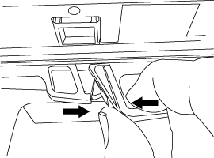
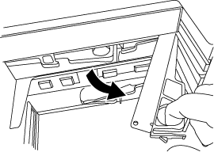

= 熱插拔或更換 DS212C、DS224C 或 DS460C IOM 模組
:allow-uri-read: 
:icons: font
:imagesdir: ../media/

[role="lead"]
您的系統配置決定了當 IOM12、IOM12B 或 IOM12C 機架 IOM 發生故障時，您可以執行非中斷式機架 IOM 熱插拔還是中斷式機架 IOM 更換。

.關於這項工作
* 此程序適用於具有 IOM12、IOM12B 或 IOM12C 模組的磁碟櫃。
+

NOTE: 此程序適用於同型號機架 IOM 熱插拔或更換。這表示您只能將 IOM12 模組更換為另一個 IOM12 模組、將 IOM12B 模組更換為另一個 IOM12B 模組，或將 IOM12C 模組更換為另一個 IOM12C 模組。

* IOM12、IOM12B 或 IOM12C 模組可以透過外觀來區分：
+
IOM12模組以「IOM12」標籤區分：

+
image::../media/drw_iom12.gif[IOM12 前方]

+
IOM12B模組以藍色等量磁碟區和「IOM12B」標籤加以區分：

+
image::../media/iom12b.png[IOM12B 正面]

+
IOM12C 模組以藍灰色條紋和「IOM12C」標籤為特徵：

+
image::../media/drw_iom12c_ieops-2175.svg[IOM12C 正面]

* 對於多路徑（多重路徑 HA 或多重路徑）、三路徑 HA 和四路徑（四路徑 HA 或四路徑）組態、您可以熱交換機櫃 IOM （不中斷地取代已開機且正在處理資料的系統中的機櫃 IOM ）。
* 對於 FAS2700 系列單路徑 HA 組態，若要更換已通電並提供資料的系統中的機櫃 IOM，必須執行接管和交還作業—I/O 正在進行中。
+

CAUTION: 如果您嘗試以單一路徑連線將磁碟櫃上的磁碟櫃IOM熱交換、您將無法存取磁碟櫃中的磁碟機、以及其下的任何磁碟櫃。您也可以關閉整個系統。

* 磁碟櫃（IOM）韌體會自動更新（不中斷營運）新機櫃IOM上的非最新韌體版本。
+
磁碟櫃IOM韌體檢查每十分鐘進行一次。IOM韌體更新最多可能需要30分鐘。

* 如有需要、您可以開啟磁碟櫃的位置（藍色）LED、以協助實際找出受影響的磁碟櫃：「儲存櫃位置導向的修改-機櫃名稱_bidle_name_-leide-Status on」
+
磁碟櫃有三個位置LED：一個在操作員顯示面板上、一個在每個機櫃IOM上。位置LED會持續亮起30分鐘。您可以輸入相同的命令、但使用「關閉」選項來關閉這些命令。

* 如有需要，您可以參考 link:service-monitor-leds.html#operator-display-panel-leds["監控磁碟架 LED"] 指南，以了解操作員顯示面板和 FRU 組件上磁碟架 LED 的含義和位置。

.開始之前
* 系統中的所有其他元件（包括其他 IOM12、IOM12B 或 IOM12C 模組）必須正常運作。
* *最佳實務*：在新增新的磁碟架、磁碟架 FRU 元件或 SAS 線纜之前，請確保您的系統已安裝最新版本的磁碟架 (IOM) 韌體和磁碟機韌體。您可以造訪NetApp支援網站 https://mysupport.netapp.com/site/downloads/firmware/disk-shelf-firmware["下載磁碟架韌體"]和 https://mysupport.netapp.com/site/downloads/firmware/disk-drive-firmware["下載磁碟機韌體"] 。

.步驟
. 請妥善接地。
. 打開新機櫃IOM的包裝、並將其放在磁碟櫃附近的水平面上。
+
保存所有包裝材料、以便在退回故障的機櫃IOM時使用。

. 從系統主控台警告訊息和故障機櫃IOM上的亮起警示（黃色）LED、實際識別故障機櫃IOM。
. 根據您的組態類型執行下列其中一項動作：
+
[cols="2*"]
|===
| 如果您有... | 然後... 

 a| 
多重路徑 HA 、三重路徑 HA 、多重路徑、四重路徑 HA 或四重路徑組態
 a| 
前往下一步。

 a| 
FAS2700 系列單路徑 HA 組態
 a| 
.. 確定目標節點（故障機櫃IOM所屬的節點）。
+
IOM A屬於控制器1。IOM B屬於控制器2。

.. 接管目標節點：「torage容錯移轉接管- bbynode_Partner HA node_」

|===
. 從您要移除的機櫃IOM上拔下纜線。
+
記下每條纜線所連接的機櫃IOM連接埠。

. 按下機櫃IOM CAM握把上的橘色栓鎖、直到釋放為止、然後完全打開CAM握把、從中間平面釋放機櫃IOM。
+

+

. 使用CAM握把將機櫃IOM滑出磁碟櫃。
+
處理機櫃IOM時、請務必用兩隻手支撐其重量。

. 在移除機櫃IOM之後、請至少等待70秒、然後再安裝新的機櫃IOM。
+
等待至少70秒、可讓駕駛正確登錄機櫃ID。

. 用兩隻手將新機櫃IOM的CAM握把置於開啟位置、支撐並將新機櫃IOM的邊緣與磁碟櫃的開孔對齊、然後將新機櫃IOM穩固推入、直到它與中間板接入。
+

NOTE: 將機櫃IOM滑入磁碟櫃時、請勿過度施力、否則可能會損壞連接器。

. 關閉CAM握把、使鎖扣卡入鎖定位置、且機櫃IOM完全就位。
. 重新連接纜線。
+
SAS纜線連接器採用鎖定式設計；正確放置於IOM連接埠時、連接器會卡入定位、且IOM連接埠LKLED會亮起綠色燈號。將SAS纜線連接器插入IOM連接埠、拉片朝下（位於連接器底部）。

. 根據您的組態類型執行下列其中一項動作：
+
[cols="2*"]
|===
| 如果您有... | 然後... 

 a| 
多重路徑 HA 、三重路徑 HA 、多重路徑、四重路徑 HA 或四重路徑組態
 a| 
前往下一步。

 a| 
FAS2700 系列單路徑 HA 組態
 a| 
歸還目標節點：「torage容錯移轉恢復- fromNode PARTNER_HA_node'

|===
. 確認已建立機櫃IOM連接埠連結。
+
對於您連接的每個模組連接埠、當四個SAS線道中有一或多個已建立連結（使用介面卡或其他磁碟櫃）時、則LNO（綠色）LED會亮起。

. 如套件隨附的RMA指示所述、將故障零件退回NetApp。
+
請聯絡技術支援人員： https://mysupport.netapp.com/site/global/dashboard["NetApp支援"]如果您需要RMA編號或更換程序的其他協助、請撥打888-463-8277（北美）、00-800-44-638277（歐洲）或+800-800-80-800（亞太地區）。

