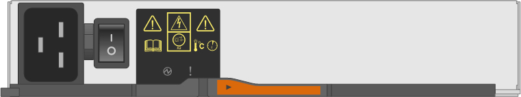

= 監控磁碟櫃LED -採用IOM12/IOM12B模組的磁碟櫃
:allow-uri-read: 
:icons: font
:imagesdir: ../media/

[role="lead"]
您可以瞭解磁碟櫃元件上LED的位置和狀態條件、以監控磁碟櫃的健全狀況。

== 操作員顯示面板LED

磁碟櫃前面的操作員顯示面板上的LED會指出磁碟櫃是否正常運作、或是硬體有問題。

下表說明DS460C、DS224C和DS212C磁碟櫃中所使用的三個控制面板LED：

[cols="4*"]
|===
| LED圖示 | LED名稱 | 州/省 | 說明 

 a| 
image::../media/drw_sas_power_icon.svg[電源圖示]
 a| 
強大威力
 a| 
持續亮綠燈
 a| 
一個或多個電源供應器正在為磁碟櫃供電。

.2+| image:../media/drw_sas_fault_icon.svg["注意圖示、寬度 = 5px"] .2+| 注意  a| 
持續亮起黃色燈號
 a| 
多個 FRU 的功能發生錯誤：磁碟櫃、磁碟機、 IOM12/ IOM12B 模組或電源供應器。

檢查事件訊息、以確定要採取的修正行動。

 a| 
呈黃色持續亮起
 a| 
機櫃ID處於擱置狀態。

關閉磁碟櫃電源後再開啟、磁碟櫃ID就會受到影響。

 a| 

 a| 
位置
 a| 
持續亮藍燈
 a| 
系統管理員啟動此LED功能、以協助實際找出需要維修的磁碟櫃。

啟動此 LED 功能時、操作員顯示面板上的位置 LED 和兩個 IOM12/ IOM12B 模組都會亮起。位置LED會在30分鐘後自動關閉。

|===
視磁碟櫃機型而定、操作員顯示面板看起來不同、但三個LED的排列方式相同。

下圖為DS224C磁碟櫃操作員顯示面板、端蓋位於：

image::../media/drw_opd.gif[端蓋駕駛員顯示幕]

== IOMM12 / IOM12B 模組 LED

IOM12/ IOM12B 模組上的 LED 會指出模組是否正常運作、是否已準備好處理 I/O 流量、以及硬體是否有任何問題。

下表說明與模組功能相關的 IOM12/ IOM12B 模組 LED 、以及模組上每個 SAS 連接埠的功能。

IOM12/ IOM12B 模組用於 DS460C 、 DS224C 和 DS212C 磁碟櫃。

[cols="4*"]
|===
| LED圖示 | LED名稱 | 州/省 | 說明 

 a| 
image::../media/drw_sas_fault_icon.svg[注意圖示]
 a| 
注意
 a| 
持續亮起黃色燈號
 a| 
IOM12/ IOM12B 模組功能： IOM12/ IOM12B 模組功能發生錯誤。

SAS連接埠功能：不到四個SAS通道建立連結（使用介面卡或其他磁碟櫃）。

檢查事件訊息、以確定要採取的修正行動。

 a| 
lnk
 a| 
連接埠連結
 a| 
持續亮綠燈
 a| 
四個SAS通道中的一個或多個建立了連結（使用介面卡或其他磁碟櫃）。

 a| 

 a| 
位置
 a| 
持續亮藍燈
 a| 
系統管理員啟動此 LED 功能、以協助實體定位故障 IOM12/ IOM12B 模組的磁碟機櫃。

啟動此 LED 功能時、操作員顯示面板上的位置 LED 和兩個 IOM12/ IOM12B 模組都會亮起。位置LED會在30分鐘後自動關閉。

|===
下圖為 IOM12 模組：

image::../media/drw_iom12.gif[IOM12 模組]

IOM12B模組以藍色等量磁碟區和「IOM12B」標籤加以區分：

image::../media/iom12b.png[IOM12B 模組]

== 電源供應器LED

電源供應器上的LED會指出電源供應器是否正常運作、或是有硬體問題。

下表說明DS460C、DS224C和DS212C磁碟櫃所使用的兩個電源供應器LED：

[cols="4*"]
|===
| LED圖示 | LED名稱 | 州/省 | 說明 

.2+| image:../media/drw_sas_power_icon.svg["功率圖示、寬度 = 20px"] .2+| 強大威力  a| 
持續亮綠燈
 a| 
電源供應器運作正常。

 a| 
關
 a| 
電源供應器故障、AC開關關閉、AC電源線未正確安裝、或電源供應器未正確供應電力。

檢查事件訊息、以確定要採取的修正行動。

 a| 
image::../media/drw_sas_fault_icon.svg[注意圖示]
 a| 
注意
 a| 
持續亮起黃色燈號
 a| 
電源供應器功能發生錯誤。

檢查事件訊息、以確定要採取的修正行動。

|===
視磁碟櫃機型而定、電源供應器可能會有所不同、這會決定兩個LED的位置。

下圖為DS460C磁碟櫃所使用的電源供應器。

這兩個LED圖示會做為標籤和LED、表示圖示本身會亮起、而且沒有鄰近的LED。

下圖為DS224C或DS212C磁碟櫃所使用的電源供應器：

image::../media/drw_powersupply_913w_vsd.gif[電源供應器 LED]

== DS460C磁碟櫃上的風扇LED

DS460C風扇上的LED會指出風扇是否正常運作、或是有硬體問題。

下表說明DS460C磁碟櫃中使用的風扇LED：

[cols="4*"]
|===
| 項目 | LED名稱 | 州/省 | 說明 

 a| 
image:../media/legend_icon_01.png["編號 1"]
 a| 
注意
 a| 
持續亮起黃色燈號
 a| 
風扇功能發生錯誤。

檢查事件訊息、以確定要採取的修正行動。

|===
image::../media/28_dwg_e2860_de460c_single_fan_canister_with_led_callout.gif[風扇注意 LED]

== 磁碟機LED

磁碟機上的LED會指出它是否正常運作、或是硬體有問題。

=== DS224C和DS212C磁碟櫃的磁碟機LED

下表說明DS224C和DS212C磁碟櫃所使用的磁碟機上的兩個LED：

[cols="4*"]
|===
| 標註 | LED名稱 | 州/省 | 說明 

.2+| image:../media/legend_icon_01.png["編號 1"] .2+| 活動  a| 
持續亮綠燈
 a| 
磁碟機已有電力。

 a| 
呈綠色持續亮起
 a| 
磁碟機已有電力、而且I/O作業正在進行中。

 a| 
image:../media/legend_icon_02.png["編號 2"]
 a| 
注意
 a| 
持續亮起黃色燈號
 a| 
磁碟機功能發生錯誤。

檢查事件訊息、以確定要採取的修正行動。

|===
視磁碟櫃模式而定、磁碟機會在磁碟櫃中垂直或水平排列、以指示兩個LED的位置。

下圖為DS224C磁碟櫃中使用的磁碟機。

DS224C磁碟櫃使用2.5吋磁碟機、垂直排列在磁碟櫃中。

image::../media/drw_diskdrive_ds224c.gif[垂直磁碟機承載器 LED]

下圖為DS212C磁碟櫃中使用的磁碟機。

DS212C磁碟櫃使用3.5吋磁碟機或2.5吋磁碟機、位於磁碟櫃中水平排列的托架中。

image::../media/drw_diskdrive_ds212c.gif[水平磁碟機承載器 LED]

=== DS460C磁碟櫃的磁碟機LED

下圖與表格說明磁碟機匣上的磁碟機活動LED及其運作狀態：

image::../media/2860_dwg_drive_drawer_leds.gif[磁碟機活動 LED]

[cols="4*"]
|===
| 位置 | LED | 狀態指示燈 | 說明 

.3+| 1. .3+| 注意：每個藥櫃的藥櫃注意事項  a| 
持續亮起黃色燈號
 a| 
磁碟機抽屜內的元件需要操作員注意。

 a| 
關
 a| 
抽屜中沒有磁碟機或其他元件需要注意、且抽屜中的磁碟機沒有作用中的定位作業。

 a| 
呈黃色持續亮起
 a| 
抽取匣內任何磁碟機的定位磁碟機作業均為作用中。

.3+| 2-13 .3+| 活動：磁碟機抽屜中磁碟機0到11的磁碟機活動  a| 
綠色
 a| 
電源開啟、磁碟機正常運作。

 a| 
呈綠色持續亮起
 a| 
磁碟機已有電力、而且I/O作業正在進行中。

 a| 
關
 a| 
電源已關閉。

|===
磁碟機抽屜開啟時、每個磁碟機前面都會出現警示LED。

image::../media/2860_dwg_amber_on_drive.gif[磁碟機注意 LED]

[cols="10,90"]
|===

 a| 
image:../media/legend_icon_01.png["編號 1"]
| 注意LED燈亮起 
|===