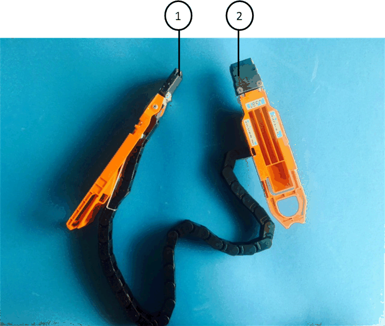

= 更換驅動器抽屜 - DS460C
:allow-uri-read: 
:icons: font
:imagesdir: ../media/

[role="lead"]
若要更換磁碟架中的磁碟機抽屜，您可以暫停整個儲存系統（HA 對），這樣可以保留磁碟架上的資料聚合。或者，您可以保持 HA 對正常運行，但這需要您將資料聚合中的所有資料移至磁碟架的磁碟機上，然後使其離線並刪除這些資料聚合。如果磁碟架包含根聚合，則必須暫停 HA 對。

此過程適用於帶有 IOM12 或 IOM12B 模組的架子。

.開始之前
此程序需要下列項目：

* 防靜電保護
+

NOTE: *可能的硬體損壞：*為了防止磁碟機櫃受到靜電釋放的損害、請在處理磁碟機櫃元件時使用適當的防靜電保護。

* 更換磁碟機匣
* 更換左和右纜線鏈
* 手電筒

.關於這項工作
* 此程式適用於具有 DCM 驅動器抽屜和/或 DCM2 或 DCM3 驅動器抽屜的機架。（機架還將配備兩個 IOM12 模組或兩個 IOM12B 模組。）
+
當 DCM、DCM2 或 DCM3 驅動器抽屜發生故障時，您會收到 DCM、DCM2 或 DCM3 驅動器抽屜來更換它。

[NOTE]
====
當您使用較新的 DCM2 或 DCM3 驅動器抽屜更換故障驅動器抽屜時，請確保ONTAP軟體和 IOM12 或 IOM12B 模組韌體運行的是支援 DCM2 或 DCM3 抽屜所需的最低版本。

IOM12韌體升級可在更換磁碟機匣之前或之後完成。此程序可讓您升級韌體、做為準備藥櫃更換程序的一部分。

====
* DCM、DCM2 和 DCM3 驅動器抽屜可以透過外觀進行區分：
+
資料中心管理員磁碟機抽屜如下所示：

+
image::../media/28_dwg_e2860_de460c_front_no_callouts.gif[DCM 磁碟機櫃的正面視圖]

+
DCM2磁碟機抽取器以藍色等量磁碟區和「DCM2」標籤加以區分：

+
image::../media/dcm2.png[DCM2 磁碟機櫃的正面視圖]

+
DCM3 驅動器抽屜以藍色和灰色條紋以及“DCM3”標籤來區分：

+
image::../media/drw_dcm3_ieops-2176.svg[DCM3 驅動器架的正面視圖]

== 步驟 1：準備更換驅動器抽屜

在更換磁碟機抽屜之前，您必須確保根據需要更新 IOM FW 和ONTAP ，並暫停 HA 對（這允許您將資料聚合保留在磁碟架上），或保持 HA 對正常運作（這需要您將所有資料從駐留在磁碟機上的資料聚合中移出）。然後，您必須離線並刪除資料聚合。但是，如果磁碟架包含根聚合，則必須暫停 HA 對。最後，您必須關閉磁碟架的電源。

.步驟
. 確定更換故障磁碟機抽屜時、是否會導致磁碟櫃結合IOM12模組和任何數量的DCM2磁碟機抽取器。
. 確定是否需要升級 IOM 韌體：
+
** 如果磁碟櫃將結合IOM12模組和任何數量的DCM2磁碟機抽取器、您必須將IOM12韌體升級至0300版或更新版本、否則請執行下一步。
** 如果機架將有 IOM12 模組和任意數量的 DCM3 驅動器抽屜組合，則必須將 IOM12 FW 升級至版本 0401 或更高版本。
** 如果機架將有 IOM12B 模組和任意數量的 DCM3 驅動器抽屜組合，則必須將 IOM12B FW 升級到版本 0202 或更高版本。

+
如果需要，您可以造訪NetApp支援站點 https://mysupport.netapp.com/site/downloads/firmware/disk-shelf-firmware["下載磁碟架韌體的目前版本"] 。否則，轉到下一步。

. 如果您的機架將有 IOM12 或 IOM12B 模組與任意數量的 DCM3 驅動器抽屜的組合，則您的系統必須運行以下最低版本的ONTAP：
+
** ONTAP 9.17.1RC1
** ONTAP 9.16.1P3
** ONTAP 9.15.1P11
** ONTAP 9.14.1P13
** ONTAP 9.13.1P16
** ONTAP 9.12.1P18

. 如果機櫃包含來自HA配對中任一控制器的根Aggregate、或是您選擇停止HA配對（而非保持HA配對正常運作）、請完成下列子步驟；否則、請執行下一步。
+

NOTE: 停止HA配對時、資料集合體仍可保留在磁碟櫃上。

+
.. 停止HA配對中的兩個控制器。
.. 檢查儲存系統主控台、確認HA配對已停止。
.. 關閉機櫃電源。
.. 轉到該部分， <<remove_cable_chains,移除纜線鏈>> 。

. 如果您選擇保持HA配對正常運作、請完成下列子步驟：
+

NOTE: 如果您嘗試以磁碟櫃上的集合體來更換藥櫃、可能會造成多磁碟毀損的系統中斷。

+
.. 將所有資料從位於機架上所有磁碟機上的資料聚合中移動。
+
資料包括但不限於磁碟區和LUN。

.. 卸除並刪除集合體、讓磁碟機成為備援磁碟機：
+
可以從任一控制器的clusterShell輸入命令。

+
'離線儲存Aggregate -Aggregate _name_'

+
'儲存Aggregate刪除-Aggregate _Aggregate名稱_'

.. 確認磁碟機沒有集合體（為備援磁碟機）：
+
... 在任一控制器的clusterShell中輸入以下命令：「torage disk show -ber櫃_bering_number_」
... 檢查輸出以確認磁碟機是否為備用磁碟機。
+
備用磁碟機在「Container Type」（容器類型）欄中顯示「shpare」（磁碟機）。

+

NOTE: 如果磁碟機在磁碟櫃中故障、「Container Type（容器類型）」欄中會出現「中斷」。

.. 關閉機櫃電源。

== 第 2 步：拆除電纜鏈

DS460C磁碟機櫃中每個磁碟機藥櫃的左右纜線鏈可讓藥櫃滑入和滑出。您必須先移除兩個纜線鏈、才能移除磁碟機抽屜。

.關於這項工作
每個磁碟機抽屜都有左右纜線鏈。纜線鏈上的金屬端點會滑入機箱內對應的垂直和水平托架、如下所示：

* 左右垂直支架可將纜線鏈連接至機箱的中板。
* 左右兩側的橫式托架可將纜線鏈連接至個別的抽屜。

.開始之前
* 您已完成<<prepare_to_replace_drive_drawer,準備更換磁碟機抽屜>>步驟，以便您的 HA 對停止或您已從駐留在磁碟機上的資料聚合中移動所有數據，並且離線並刪除資料聚合以允許磁碟機成為備用磁碟機。
* 您已關閉磁碟櫃電源。
* 您已取得下列項目：
+
** 防靜電保護
+

NOTE: *可能的硬體損壞：*為避免對磁碟櫃造成靜電損害、請在處理磁碟櫃元件時使用適當的防靜電保護。

** 手電筒

.步驟
. 提供防靜電保護。
. 從磁碟機櫃的背面、如下所示、卸下適當的風扇模組：
+
.. 按下橘色彈片以釋放風扇模組的握把。
+
圖中顯示了風扇模組延伸的握把、並從左側的橘色索引標籤中釋放。

+
image::../media/28_dwg_e2860_de460c_fan_canister_handle_with_callout.gif[延伸風扇模組把手]

+
[cols="10,90"]
|===

 a| 
image:../media/icon_round_1.png["編號 1"]
| 風扇模組握把 
|===
.. 使用握把、將風扇模組從磁碟機櫃中拉出、然後放在一旁。

. 手動判斷要中斷連接的五個纜線鏈中的哪一個。
+
圖中顯示了卸下風扇模組的磁碟機櫃右側。卸下風扇模組之後、您可以看到每個抽屜的五個纜線鏈、以及垂直和水平連接器。提供磁碟機匣1的標註。

+
image::../media/2860_dwg_full_back_view_chain_connectors.gif[檢視每個抽屜的五個纜線鏈、以及垂直和水平連接器]

+
[cols="10,90"]
|===

 a| 
image:../media/icon_round_1.png["編號 1"]
| 纜線鏈 

 a| 
image:../media/icon_round_2.png["編號 2"]
 a| 
直立連接器（連接至中板）

 a| 
image:../media/icon_round_3.png["編號 3"]
 a| 
橫式連接器（連接至磁碟機匣）

|===
+
頂端纜線鏈連接至磁碟機抽屜1。底部的纜線鏈連接至磁碟機抽屜5。

. 用手指將右側的纜線鏈往左移動。
. 請依照下列步驟、從對應的垂直支架上拔下任何正確的纜線鏈。
+
.. 使用手電筒、找出連接至機箱垂直支架的纜線鏈末端的橘色環。
+
image::../media/2860_dwg_vertical_ring_for_chain.gif[纜線鏈末端的橘色環]

+
[cols="10,90"]
|===

 a| 
image:../media/icon_round_1.png["編號 1"]
| 垂直托架上的橘色環 
|===
.. 輕按橘色環的中央、並將纜線的左側拉出機箱、以拔下垂直連接器（連接至中板）。
.. 若要拔下纜線鏈、請小心地將手指朝自己的方向拉約1英吋（2.5公分）、但將纜線鏈接頭留在垂直托架內。

. 請依照下列步驟拔下纜線鏈的另一端：
+
.. 使用手電筒、找出連接至機箱中橫式托架的纜線鏈末端的橘色環。
+
圖中所示為右側的橫式連接器、而纜線鏈已中斷連接、並部分拉出左側。

+
image::../media/2860_dwg_horiz_ring_for_chain.gif[纜線鏈和橘色環]

+
[cols="10,90"]
|===

 a| 
image:../media/icon_round_1.png["編號 1"]
| 橫式支架上的橘色環 

 a| 
image:../media/icon_round_2.png["編號 2"]
 a| 
纜線鏈

|===
.. 將手指輕插入橘色環。
+
圖中所示為水平支架上的橘色環、可向下推、以便將其餘的纜線鏈從機箱中拉出。

.. 朝自己的方向拉動手指、拔下纜線鏈。

. 小心地將整個纜線鏈從磁碟機櫃中拉出。
. 從磁碟機櫃背面、移除左側的風扇模組。
. 請依照下列步驟、從垂直托架上拔下左纜線鏈：
+
.. 使用手電筒、找出連接至垂直托架的纜線鏈末端的橘色環。
.. 將手指插入橘色環。
.. 若要拔下纜線鏈、請將手指朝自己的方向拉約1英吋（2.5公分）、但將纜線鏈接頭留在垂直托架內。

. 從橫式支架拔下左纜線鏈、並將整個纜線鏈從磁碟機櫃中拉出。

== 步驟 3：移除驅動器抽屜

移除左右纜線鏈之後、您可以從磁碟機櫃中移除磁碟機抽屜。移除磁碟機抽取器時、必須將抽取器的一部分滑出、移除磁碟機、以及移除磁碟機抽取器。

.開始之前
* 您已移除磁碟機抽屜的左右纜線鏈。
* 您已更換左右風扇模組。

.步驟
. 從磁碟機櫃正面卸下擋板。
. 拉出兩個拉桿、以解開磁碟機抽屜。
. 使用延伸槓桿、小心地將磁碟機抽屜拉出、直到它停止為止。請勿將磁碟機匣從磁碟機櫃中完全移除。
. 從磁碟機匣中取出磁碟機：
+
.. 將每個磁碟機正面中央可見的橘色釋放栓扣、輕拉回。下圖顯示每個磁碟機的橘色釋放栓鎖。
+
image::../media/28_dwg_e2860_drive_latches_top_view.gif[磁碟機釋放閂鎖]

.. 將磁碟機握把垂直提起。
.. 使用握把將磁碟機從磁碟機匣中提出。
+
image::../media/92_dwg_de6600_install_or_remove_drive.gif[安裝或移除磁碟機]

.. 將磁碟機放在無靜電的平面上、遠離磁性裝置。
+

NOTE: *可能的資料存取遺失：*磁區可能會破壞磁碟機上的所有資料、並對磁碟機電路造成無法修復的損害。為了避免資料遺失及磁碟機受損、請務必將磁碟機遠離磁性裝置。

. 請依照下列步驟移除磁碟機匣：
+
.. 找到磁碟機抽屜兩側的塑膠釋放拉桿。
+
image::../media/92_pht_de6600_drive_drawer_release_lever.gif[藥屜釋放桿]

+
[cols="10,90"]
|===

 a| 
image:../media/icon_round_1.png["編號 1"]
| 磁碟機抽屜釋放槓桿 
|===
.. 朝自己的方向拉動鎖條、開啟兩個釋放拉桿。
.. 同時按住兩個釋放拉桿、將磁碟機抽屜朝自己的方向拉動。
.. 從磁碟機櫃中取出磁碟機匣。

== 步驟 4：安裝驅動器抽屜

若要將磁碟機抽取器安裝到磁碟機櫃中、必須將抽取器滑入閒置的插槽、安裝磁碟機、以及更換前擋板。

.開始之前
* 您已取得下列項目：
+
** 更換磁碟機匣
** 手電筒

.步驟
. 從磁碟機櫃的正面、將一顆閃燈放入空的抽屜插槽、然後找出該插槽的鎖定彈片。
+
鎖定的翻轉器組件是一項安全功能、可防止您一次開啟多個磁碟機抽屜。

+
image::../media/92_pht_de6600_lock_out_tumbler_detail.gif[鎖定玻璃杯和抽屜導板的位置]

+
[cols="10,90"]
|===

 a| 
image:../media/icon_round_1.png["編號 1"]
| 鎖定翻轉器 

 a| 
image:../media/icon_round_2.png["編號 2"]
 a| 
抽屜指南

|===
. 將更換的磁碟機抽取器放在空插槽前方、並稍微放在中央右側。
+
將抽屜稍微放在中央右側、有助於確保鎖定的翻轉器和抽屜導引器已正確接合。

. 將磁碟機抽屜滑入插槽、並確定抽屜導板滑入鎖定的轉筒下方。
+

NOTE: *設備受損風險：*如果抽屜導板未滑入鎖定的翻轉器下方、就會造成損壞。

. 小心將磁碟機抽屜完全推入、直到鎖扣完全卡入為止。
+

NOTE: *設備受損風險：*如果您感到過度阻力或卡滯、請停止推動磁碟機抽屜。使用抽屜正面的釋放拉桿、將抽屜滑出。然後將抽屜重新插入插槽、並確保抽屜可自由滑入和滑出。

. 請依照下列步驟、將磁碟機重新安裝到磁碟機匣中：
+
.. 拉出抽屜正面的兩個拉桿、以解開磁碟機抽屜。
.. 使用延伸槓桿、小心地將磁碟機抽屜拉出、直到它停止為止。請勿將磁碟機匣從磁碟機櫃中完全移除。
.. 在您要安裝的磁碟機上、將握把垂直提起。
.. 將磁碟機兩側的兩個凸起按鈕對齊抽屜的槽口。
+
圖中顯示了磁碟機的右側視圖、顯示了凸起按鈕的位置。

+
image::../media/28_dwg_e2860_de460c_drive_cru.gif[磁碟機上凸起按鈕的位置]

+
[cols="10,90"]
|===

 a| 
image:../media/icon_round_1.png["編號 1"]
| 磁碟機右側的凸起按鈕。 
|===
.. 將磁碟機垂直向下放、然後向下轉動磁碟機握把、直到磁碟機卡入定位。
+
如果您的磁碟櫃已部分裝入、表示您要重新安裝磁碟機的磁碟櫃所含的磁碟機數量少於其支援的12個磁碟機、請將前四個磁碟機安裝至前插槽（0、3、6和9）。

+

NOTE: *設備故障風險：*為了確保適當的氣流並避免過熱、請務必將前四個磁碟機安裝到前插槽（0、3、6和9）。

+
image::../media/92_dwg_de6600_install_or_remove_drive.gif[安裝或移除磁碟機]

.. 重複這些子步驟以重新安裝所有磁碟機。

. 將抽屜從中央推回磁碟機櫃、然後關閉兩個槓桿。
+

NOTE: *設備故障風險：*請務必同時推動兩個槓桿、以完全關閉磁碟機抽屜。您必須完全關閉磁碟機抽取器、以確保通風良好、並避免過熱。

. 將擋板連接至磁碟機櫃的正面。

== 步驟 5：連接電纜鏈

安裝磁碟機抽屜的最後步驟、是將更換的左右纜線鏈連接至磁碟機櫃。連接纜線鏈時、請依照您拔下纜線鏈時的順序進行。您必須先將鏈的橫式連接器插入機箱的橫式托架、然後再將鏈的垂直連接器插入機箱的垂直托架。

.開始之前
* 您已更換磁碟機抽屜和所有磁碟機。
* 您有兩個替換的纜線鏈、分別標示為左和右（位於磁碟機抽屜旁的橫式連接器上）。

[cols="4*"]
|===
| 標註 | 纜線鏈 | 連接器 | 連線至 

 a| 
image:../media/icon_round_1.png["編號 1"]
| 左  a| 
垂直
 a| 
中板

 a| 
image:../media/icon_round_2.png["編號 2"]
 a| 
左
 a| 
橫式
 a| 
磁碟機抽屜

|===
image:../media/28_dwg_e2860_de460c_cable_chain_right.gif["右側更換纜線鏈"]

[cols="4*"]
|===
| 標註 | 纜線鏈 | 連接器 | 連線至 

 a| 
image:../media/icon_round_1.png["編號 1"]
| 沒錯  a| 
橫式
 a| 
磁碟機抽屜

 a| 
image:../media/icon_round_2.png["編號 2"]
 a| 
沒錯
 a| 
垂直
 a| 
中板

|===
.步驟
. 請依照下列步驟連接左纜線鏈：
+
.. 找到左纜線鏈上的水平和垂直連接器、以及機箱內對應的水平和垂直支架。
.. 將兩個纜線鏈連接器對齊其對應的支架。
.. 將纜線鏈的橫式連接器滑入橫式托架上的導軌下方、並將其推入到底。
+
圖中所示為機箱中第二個磁碟機抽屜左側的導軌。

+
image::../media/2860_dwg_guide_rail.gif[導軌]

+
[cols="10,90"]
|===

 a| 
image:../media/icon_round_1.png["編號 1"]
| 導軌 
|===
+
[NOTE]
====
*設備故障風險：*請務必將連接器滑入支架導軌下方。如果連接器位於導軌頂端、則系統執行時可能會發生問題。

====
.. 將左纜線鏈上的垂直連接器滑入垂直托架。
.. 重新連接纜線鏈的兩端之後、請小心拉動纜線鏈、以確認兩個連接器均已鎖定。
+
[NOTE]
====
*設備故障風險：*如果連接器未鎖定、纜線鏈可能會在抽取器運作期間鬆脫。

====

. 重新安裝左風扇模組。
. 請依照下列步驟重新連接正確的纜線鏈：
+
.. 找到纜線鏈上的水平和垂直連接器、以及機箱內對應的水平和垂直支架。
.. 將兩個纜線鏈連接器對齊其對應的支架。
.. 將纜線鏈的橫式連接器滑入橫式托架上的導軌下方、並將其推入到底。
+
[NOTE]
====
*設備故障風險：*請務必將連接器滑入支架導軌下方。如果連接器位於導軌頂端、則系統執行時可能會發生問題。

====
.. 將右側纜線鏈上的垂直連接器滑入垂直托架。
.. 重新連接纜線鏈的兩端之後、請小心拉動纜線鏈、以確認兩個連接器均已鎖定。
+
[NOTE]
====
*設備故障風險：*如果連接器未鎖定、纜線鏈可能會在抽取器運作期間鬆脫。

====

. 重新安裝正確的風扇模組。
. 重新應用電力：
+
.. 開啟磁碟機櫃上的兩個電源開關。
.. 確認兩個風扇均已開啟、且風扇背面的黃色LED燈已關閉。

. 如果您已停止HA配對、請在ONTAP 兩個控制器上都開機支援功能、否則請執行下一步。
. 如果您已將資料移出磁碟架並刪除了資料聚合，現在可以使用磁碟架中的備用磁碟來建立或擴充聚合。要了解有關這些過程的更多信息，請參閱 https://docs.netapp.com/us-en/ontap/disks-aggregates/aggregate-creation-workflow-concept.html["Aggregate建立工作流程"]和 https://docs.netapp.com/us-en/ontap/disks-aggregates/aggregate-expansion-workflow-concept.html["Aggregate擴充工作流程"] 。

