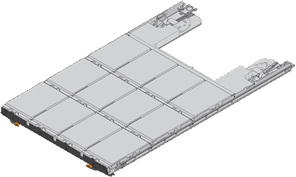
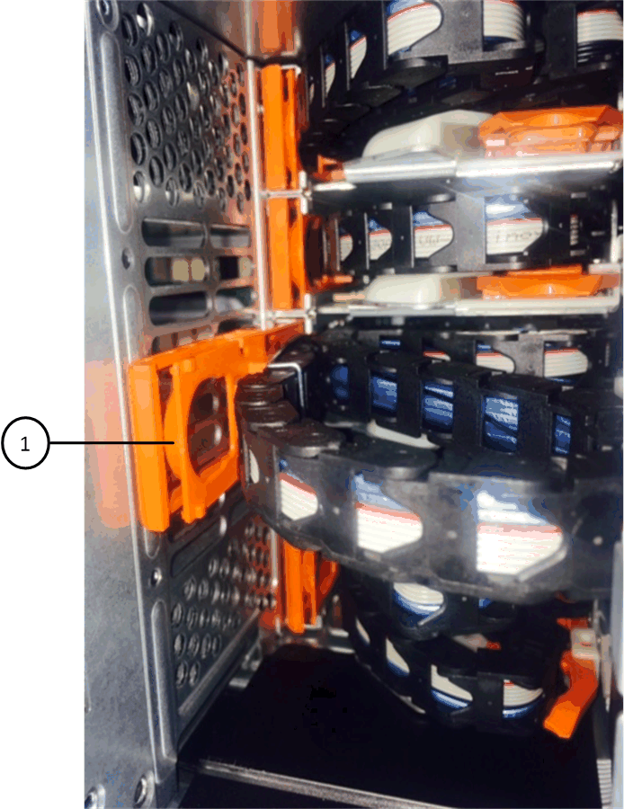
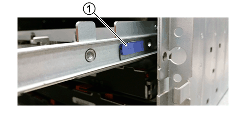
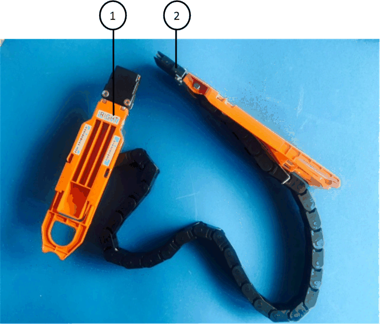

= 將DS460C磁碟櫃中的磁碟機匣更換為IOM12模組的磁碟櫃
:allow-uri-read: 
:icons: font
:imagesdir: ../media/

[role="lead"]
更換磁碟機匣之前、您必須停止所有主機I/O活動並關閉磁碟櫃電源。

每個60個磁碟機磁碟櫃都有五個磁碟機匣。

image::../media/28_dwg_e2860_de460c_front_no_callouts.gif[28圖e2860 de460c正面無標註]

五個抽屜各可容納12個磁碟機。

此程序需要下列項目：

* 防靜電保護
+

NOTE: *可能的硬體損壞：*為了防止磁碟機櫃受到靜電釋放的損害、請在處理磁碟機櫃元件時使用適當的防靜電保護。

* 更換磁碟機匣
* 更換左和右纜線鏈
* 手電筒
* 永久標記

== 移除纜線鏈

[role="lead"]
DS460C磁碟機櫃中每個磁碟機藥櫃的左右纜線鏈可讓藥櫃滑入和滑出。您必須先移除兩個纜線鏈、才能移除磁碟機抽屜。

.開始之前
* 您已停止主機I/O活動、並將磁碟櫃關機。
* 您已取得下列項目：
+
** 防靜電保護
+

NOTE: *可能的硬體損壞：*為避免對磁碟櫃造成靜電損害、請在處理磁碟櫃元件時使用適當的防靜電保護。

** 手電筒

每個磁碟機抽屜都有左右纜線鏈。纜線鏈上的金屬端點會滑入機箱內對應的垂直和水平托架、如下所示：

* 左右垂直支架可將纜線鏈連接至機箱的中板。
* 左右兩側的橫式托架可將纜線鏈連接至個別的抽屜。

.步驟
. 提供防靜電保護。
. 從磁碟機櫃的背面、如下所示、卸下適當的風扇模組：
+
.. 按下橘色彈片以釋放風扇模組的握把。
+
圖中顯示了風扇模組延伸的握把、並從左側的橘色索引標籤中釋放。

+
image::../media/28_dwg_e2860_de460c_fan_canister_handle_with_callout.gif[28圖e2860 de460c風扇箱把手上附有標註]

+
|===

 a| 
image:../media/legend_icon_01.png[""]
| 風扇模組握把 
|===
.. 使用握把、將風扇模組從磁碟機櫃中拉出、然後放在一旁。

. 手動判斷要中斷連接的五個纜線鏈中的哪一個。
+
圖中顯示了卸下風扇模組的磁碟機櫃右側。卸下風扇模組之後、您可以看到每個抽屜的五個纜線鏈、以及垂直和水平連接器。提供磁碟機匣1的標註。

+
image::../media/2860_dwg_full_back_view_chain_connectors.gif[2860 dwx全後視圖鏈連接器]

+
|===

 a| 
image:../media/legend_icon_01.png[""]
| 纜線鏈 

 a| 
image:../media/legend_icon_02.png[""]
 a| 
直立連接器（連接至中板）

 a| 
image:../media/legend_icon_03.png[""]
 a| 
橫式連接器（連接至磁碟機匣）

|===
+
頂端纜線鏈連接至磁碟機抽屜1。底部的纜線鏈連接至磁碟機抽屜5。

. 用手指將右側的纜線鏈往左移動。
. 請依照下列步驟、從對應的垂直支架上拔下任何正確的纜線鏈。
+
.. 使用手電筒、找出連接至機箱垂直支架的纜線鏈末端的橘色環。
+

+
|===

 a| 
image:../media/legend_icon_01.png[""]
| 垂直托架上的橘色環 
|===
.. 輕按橘色環的中央、並將纜線的左側拉出機箱、以拔下垂直連接器（連接至中板）。
.. 若要拔下纜線鏈、請小心地將手指朝自己的方向拉約1英吋（2.5公分）、但將纜線鏈接頭留在垂直托架內。

. 請依照下列步驟拔下纜線鏈的另一端：
+
.. 使用手電筒、找出連接至機箱中橫式托架的纜線鏈末端的橘色環。
+
圖中所示為右側的橫式連接器、而纜線鏈已中斷連接、並部分拉出左側。

+
image::../media/2860_dwg_horiz_ring_for_chain.gif[用於鏈的2860 dx水平環]

+
|===

 a| 
image:../media/legend_icon_01.png[""]
| 橫式支架上的橘色環 

 a| 
image:../media/legend_icon_02.png[""]
 a| 
纜線鏈

|===
.. 將手指輕插入橘色環。
+
圖中所示為水平支架上的橘色環、可向下推、以便將其餘的纜線鏈從機箱中拉出。

.. 朝自己的方向拉動手指、拔下纜線鏈。

. 小心地將整個纜線鏈從磁碟機櫃中拉出。
. 從磁碟機櫃背面、移除左側的風扇模組。
. 請依照下列步驟、從垂直托架上拔下左纜線鏈：
+
.. 使用手電筒、找出連接至垂直托架的纜線鏈末端的橘色環。
.. 將手指插入橘色環。
.. 若要拔下纜線鏈、請將手指朝自己的方向拉約1英吋（2.5公分）、但將纜線鏈接頭留在垂直托架內。

. 從橫式支架拔下左纜線鏈、並將整個纜線鏈從磁碟機櫃中拉出。

== 移除磁碟機抽屜

[role="lead"]
移除左右纜線鏈之後、您可以從磁碟機櫃中移除磁碟機抽屜。移除磁碟機抽取器時、必須將抽取器的一部分滑出、記錄磁碟機的位置、移除磁碟機、以及移除磁碟機抽取器。

.開始之前
* 您已移除磁碟機抽屜的左右纜線鏈。
* 您已更換左右風扇模組。
* 從抽屜中取出磁碟機時、您已取得永久標記、以記下每個磁碟機的確切位置。

.步驟
. 從磁碟機櫃正面卸下擋板。
. 拉出兩個拉桿、以解開磁碟機抽屜。
. 使用延伸槓桿、小心地將磁碟機抽屜拉出、直到它停止為止。請勿將磁碟機匣從磁碟機櫃中完全移除。
. 如果已建立並指派邏輯單元編號（LUN）、請使用永久性標記來記錄每個磁碟機的確切位置。例如、使用下列圖示做為參考、在每個磁碟機的頂端寫下適當的插槽編號。
+
image::../media/dwg_trafford_drawer_with_hdds_callouts.gif[具備HDD標註的Dwgt Trap抽屜]

+

NOTE: *可能會遺失資料存取：*請務必在移除每個磁碟機之前、先記錄其確切位置。

. 從磁碟機匣中取出磁碟機：
+
.. 將每個磁碟機正面中央可見的橘色釋放栓扣、輕拉回。下圖顯示每個磁碟機的橘色釋放栓鎖。
+
image::../media/28_dwg_e2860_drive_latches_top_view.gif[28圖e2860磁碟機栓鎖頂端視圖]

.. 將磁碟機握把垂直提起。
.. 使用握把將磁碟機從磁碟機匣中提出。
+
image::../media/92_dwg_de6600_install_or_remove_drive.gif[92 dwgde6600安裝或移除磁碟機]

.. 將磁碟機放在無靜電的平面上、遠離磁性裝置。
+

NOTE: *可能的資料存取遺失：*磁區可能會破壞磁碟機上的所有資料、並對磁碟機電路造成無法修復的損害。為了避免資料遺失及磁碟機受損、請務必將磁碟機遠離磁性裝置。

. 請依照下列步驟移除磁碟機匣：
+
.. 找到磁碟機抽屜兩側的塑膠釋放拉桿。
+

+
|===

 a| 
image:../media/legend_icon_01.png[""]
| 磁碟機抽屜釋放槓桿 
|===
.. 朝自己的方向拉動鎖條、開啟兩個釋放拉桿。
.. 同時按住兩個釋放拉桿、將磁碟機抽屜朝自己的方向拉動。
.. 從磁碟機櫃中取出磁碟機匣。

== 安裝磁碟機抽屜

[role="lead"]
若要將磁碟機抽取器安裝到磁碟機櫃中、必須將抽取器滑入閒置的插槽、安裝磁碟機、以及更換前擋板。

.開始之前
* 您知道每個磁碟機的安裝位置。
* 您已取得下列項目：
+
** 更換磁碟機匣
** 手電筒

.步驟
. 從磁碟機櫃的正面、將一顆閃燈放入空的抽屜插槽、然後找出該插槽的鎖定彈片。
+
鎖定的翻轉器組件是一項安全功能、可防止您一次開啟多個磁碟機抽屜。

+
image::../media/92_pht_de6600_lock_out_tumbler_detail.gif[92 PHT de6600可鎖定翻轉器的詳細資料]

+
|===

 a| 
image:../media/legend_icon_01.png[""]
| 鎖定翻轉器 

 a| 
image:../media/legend_icon_02.png[""]
 a| 
抽屜指南

|===
. 將更換的磁碟機抽取器放在空插槽前方、並稍微放在中央右側。
+
將抽屜稍微放在中央右側、有助於確保鎖定的翻轉器和抽屜導引器已正確接合。

. 將磁碟機抽屜滑入插槽、並確定抽屜導板滑入鎖定的轉筒下方。
+

NOTE: *設備受損風險：*如果抽屜導板未滑入鎖定的翻轉器下方、就會造成損壞。

. 小心將磁碟機抽屜完全推入、直到鎖扣完全卡入為止。
+

NOTE: *設備受損風險：*如果您感到過度阻力或卡滯、請停止推動磁碟機抽屜。使用抽屜正面的釋放拉桿、將抽屜滑出。然後將抽屜重新插入插槽、並確保抽屜可自由滑入和滑出。

. 請依照下列步驟、將磁碟機重新安裝到磁碟機匣中：
+
.. 拉出抽屜正面的兩個拉桿、以解開磁碟機抽屜。
.. 使用延伸槓桿、小心地將磁碟機抽屜拉出、直到它停止為止。請勿將磁碟機匣從磁碟機櫃中完全移除。
.. 使用您在卸下磁碟機時所做的備註、判斷每個插槽中要安裝的磁碟機。
+

NOTE: *可能會遺失資料存取：*您必須將每個磁碟機安裝在磁碟機抽屜的原始位置。

+
image::../media/dwg_trafford_drawer_with_hdds_callouts.gif[具備HDD標註的Dwgt Trap抽屜]

.. 將磁碟機上的握把垂直提起。
.. 將磁碟機兩側的兩個凸起按鈕對齊抽屜的槽口。
+
圖中顯示了磁碟機的右側視圖、顯示了凸起按鈕的位置。

+
image::../media/28_dwg_e2860_de460c_drive_cru.gif[28圖e2860 de460c磁碟機CRU]

+
|===

 a| 
image:../media/legend_icon_01.png[""]
| 磁碟機右側的凸起按鈕。 
|===
.. 將磁碟機垂直向下放、然後向下轉動磁碟機握把、直到磁碟機卡入定位。
+
image::../media/92_dwg_de6600_install_or_remove_drive.gif[92 dwgde6600安裝或移除磁碟機]

.. 重複這些子步驟以重新安裝所有磁碟機。

. 將抽屜從中央推回磁碟機櫃、然後關閉兩個槓桿。
+

NOTE: *設備故障風險：*請務必同時推動兩個槓桿、以完全關閉磁碟機抽屜。您必須完全關閉磁碟機抽取器、以確保通風良好、並避免過熱。

. 將擋板連接至磁碟機櫃的正面。

== 連接纜線鏈

[role="lead"]
安裝磁碟機抽屜的最後步驟、是將左右纜線鏈連接至磁碟機櫃。連接纜線鏈時、請依照您拔下纜線鏈時的順序進行。您必須先將鏈的橫式連接器插入機箱的橫式托架、然後再將鏈的垂直連接器插入機箱的垂直托架。

.開始之前
* 您已更換磁碟機抽屜和所有磁碟機。
* 您有兩個替換的纜線鏈、分別標示為左和右（位於磁碟機抽屜旁的橫式連接器上）。

image::../media/28_dwg_e2860_de460c_cable_chain_left.gif[28圖e2860 de460c纜線鏈剩餘]

[cols="4*"]
|===
| 標註 | 纜線鏈 | 連接器 | 連線至 

 a| 
image:../media/legend_icon_01.png[""]
| 左  a| 
垂直
 a| 
中板

 a| 
image:../media/legend_icon_02.png[""]
 a| 
左
 a| 
橫式
 a| 
磁碟機抽屜

|===

[cols="4*"]
|===
| 標註 | 纜線鏈 | 連接器 | 連線至 

 a| 
image:../media/legend_icon_01.png[""]
| 沒錯  a| 
橫式
 a| 
磁碟機抽屜

 a| 
image:../media/legend_icon_02.png[""]
 a| 
沒錯
 a| 
垂直
 a| 
中板

|===
.步驟
. 請依照下列步驟連接左纜線鏈：
+
.. 找到左纜線鏈上的水平和垂直連接器、以及機箱內對應的水平和垂直支架。
.. 將兩個纜線鏈連接器對齊其對應的支架。
.. 將纜線鏈的橫式連接器滑入橫式托架上的導軌下方、並將其推入到底。
+
圖中所示為機箱中第二個磁碟機抽屜左側的導軌。

+
image::../media/2860_dwg_guide_rail.gif[2860 dwx導軌]

+
|===

 a| 
image:../media/legend_icon_01.png[""]
| 導軌 
|===
+
[NOTE]
====
*設備故障風險：*請務必將連接器滑入支架導軌下方。如果連接器位於導軌頂端、則系統執行時可能會發生問題。

====
.. 將左纜線鏈上的垂直連接器滑入垂直托架。
.. 重新連接纜線鏈的兩端之後、請小心拉動纜線鏈、以確認兩個連接器均已鎖定。
+
[NOTE]
====
*設備故障風險：*如果連接器未鎖定、纜線鏈可能會在抽取器運作期間鬆脫。

====

. 重新安裝左風扇模組。
. 請依照下列步驟重新連接正確的纜線鏈：
+
.. 找到纜線鏈上的水平和垂直連接器、以及機箱內對應的水平和垂直支架。
.. 將兩個纜線鏈連接器對齊其對應的支架。
.. 將纜線鏈的橫式連接器滑入橫式托架上的導軌下方、並將其推入到底。
+
[NOTE]
====
*設備故障風險：*請務必將連接器滑入支架導軌下方。如果連接器位於導軌頂端、則系統執行時可能會發生問題。

====
.. 將右側纜線鏈上的垂直連接器滑入垂直托架。
.. 重新連接纜線鏈的兩端之後、請小心拉動纜線鏈、以確認兩個連接器均已鎖定。
+
[NOTE]
====
*設備故障風險：*如果連接器未鎖定、纜線鏈可能會在抽取器運作期間鬆脫。

====

. 重新安裝正確的風扇模組。
. 重新應用電力：
+
.. 開啟磁碟機櫃上的兩個電源開關。
.. 確認兩個風扇均已開啟、且風扇背面的黃色LED燈已關閉。

